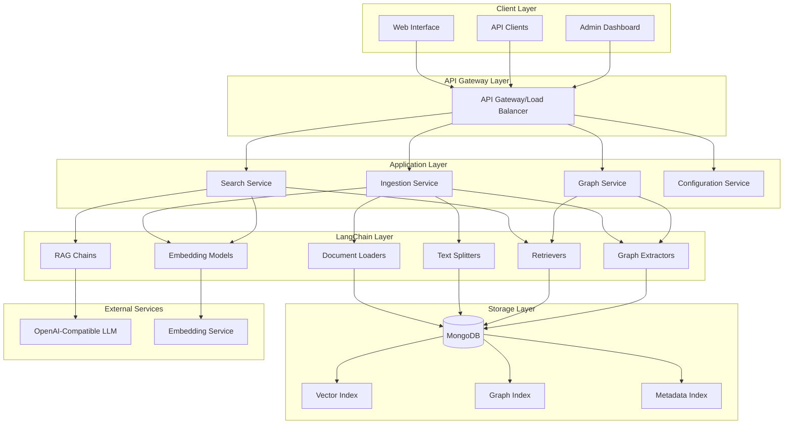
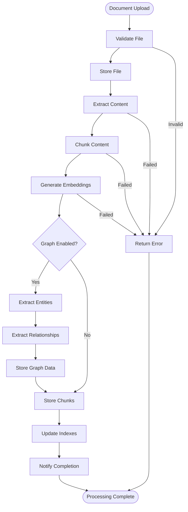
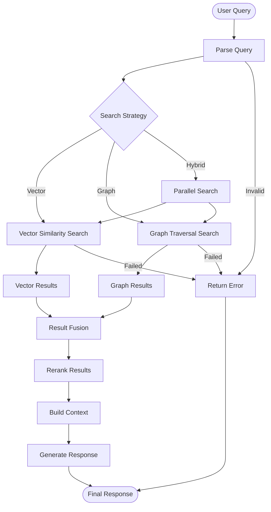
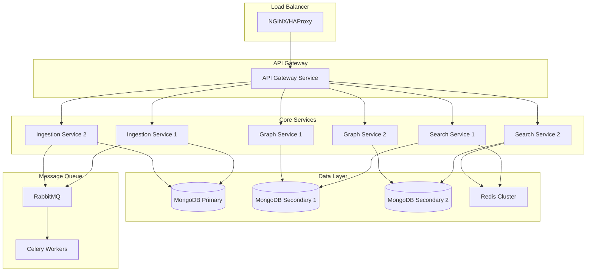

# LangChain MongoDB RAG Application - Architecture Specification

## Table of Contents
1. [System Overview](#system-overview)
2. [Overall System Architecture](#overall-system-architecture)
3. [MongoDB Schema Design](#mongodb-schema-design)
4. [LangChain Integration Patterns](#langchain-integration-patterns)
5. [API Design](#api-design)
6. [Data Flow Diagrams](#data-flow-diagrams)
7. [Graph Data Model](#graph-data-model)
8. [Graph Traversal Algorithms](#graph-traversal-algorithms)
9. [Configuration Management](#configuration-management)
10. [Technology Stack](#technology-stack)
11. [Scalability Patterns](#scalability-patterns)
12. [Error Handling and Logging](#error-handling-and-logging)
13. [Document Processing Strategies](#document-processing-strategies)
14. [Indexing Strategies](#indexing-strategies)
15. [Deployment Architecture](#deployment-architecture)

## System Overview

This specification defines a comprehensive RAG (Retrieval-Augmented Generation) application that combines LangChain's powerful orchestration capabilities with MongoDB's hybrid vector and graph search features. The system is designed to handle business documents with complex organizational relationships while maintaining flexibility for future scaling.

### Key Design Principles
- **Modularity**: Graph features are optional and can be enabled/disabled
- **Scalability**: Architecture supports growth from single-instance to distributed deployment
- **Flexibility**: Supports mixed content types and evolving requirements
- **Performance**: Optimized for both vector similarity and graph traversal queries
- **Maintainability**: Clear separation of concerns and well-defined interfaces

## Overall System Architecture



### Component Relationships

#### Core Services
- **Ingestion Service**: Handles document upload, processing, and storage
- **Search Service**: Manages vector similarity and hybrid search operations
- **Graph Service**: Handles graph-based queries and relationship traversal
- **Configuration Service**: Manages feature flags and system configuration

#### LangChain Integration
- **Document Loaders**: Handle various file formats (PDF, DOCX, HTML, etc.)
- **Text Splitters**: Intelligent chunking for optimal retrieval
- **Embedding Models**: Vector representation generation
- **Retrievers**: Hybrid retrieval combining vector and graph search
- **RAG Chains**: End-to-end question-answering workflows
- **Graph Extractors**: Entity and relationship extraction from documents

## MongoDB Schema Design

### Collections Structure

#### 1. Documents Collection
```javascript
{
  _id: ObjectId,
  document_id: "doc_12345",
  title: "Annual Report 2023",
  content_type: "application/pdf",
  source_url: "https://example.com/report.pdf",
  file_path: "/uploads/report.pdf",
  metadata: {
    author: "John Doe",
    created_date: ISODate("2023-01-15"),
    department: "Finance",
    document_type: "report",
    tags: ["annual", "financial", "2023"],
    file_size: 2048576,
    page_count: 45
  },
  processing_status: "completed",
  graph_enabled: true,
  created_at: ISODate("2023-01-16T10:00:00Z"),
  updated_at: ISODate("2023-01-16T10:30:00Z")
}
```

#### 2. Chunks Collection
```javascript
{
  _id: ObjectId,
  chunk_id: "chunk_12345_001",
  document_id: "doc_12345",
  content: "This section discusses the financial performance...",
  chunk_index: 0,
  chunk_type: "text", // text, table, image_caption
  metadata: {
    page_number: 1,
    section: "Executive Summary",
    word_count: 150,
    char_count: 890
  },
  embedding: [0.1, 0.2, -0.3, ...], // 1536-dimensional vector
  graph_entities: ["Finance Department", "Q4 2023", "Revenue Growth"],
  created_at: ISODate("2023-01-16T10:15:00Z")
}
```

#### 3. Entities Collection (Graph Nodes)
```javascript
{
  _id: ObjectId,
  entity_id: "entity_12345",
  name: "Finance Department",
  type: "organization", // person, organization, concept, location, date
  aliases: ["Financial Dept", "Finance Div"],
  properties: {
    description: "Corporate finance division",
    category: "department",
    established: "2010",
    head: "Jane Smith"
  },
  document_references: ["doc_12345", "doc_67890"],
  chunk_references: ["chunk_12345_001", "chunk_67890_003"],
  confidence_score: 0.95,
  created_at: ISODate("2023-01-16T10:20:00Z"),
  updated_at: ISODate("2023-01-16T10:25:00Z")
}
```

#### 4. Relationships Collection (Graph Edges)
```javascript
{
  _id: ObjectId,
  relationship_id: "rel_12345",
  source_entity_id: "entity_12345",
  target_entity_id: "entity_67890",
  relationship_type: "reports_to", // reports_to, collaborates_with, mentions, references
  properties: {
    strength: 0.8,
    frequency: 5,
    context: "organizational hierarchy"
  },
  evidence: [
    {
      document_id: "doc_12345",
      chunk_id: "chunk_12345_001",
      text_snippet: "Finance Department reports to the CFO",
      confidence: 0.9
    }
  ],
  created_at: ISODate("2023-01-16T10:25:00Z")
}
```

#### 5. Search Sessions Collection
```javascript
{
  _id: ObjectId,
  session_id: "session_12345",
  query: "What was the revenue growth in Q4 2023?",
  search_type: "hybrid", // vector, graph, hybrid
  parameters: {
    vector_similarity_threshold: 0.7,
    graph_traversal_depth: 2,
    max_results: 10
  },
  results: [
    {
      chunk_id: "chunk_12345_001",
      score: 0.95,
      retrieval_method: "vector"
    }
  ],
  response: "The revenue growth in Q4 2023 was 15%...",
  execution_time_ms: 250,
  created_at: ISODate("2023-01-16T11:00:00Z")
}
```

### Indexing Strategy

#### Vector Search Indexes
```javascript
// Vector index on chunks collection
db.chunks.createIndex(
  { "embedding": "vectorSearch" },
  {
    "vectorSearchOptions": {
      "type": "vectorSearch",
      "numDimensions": 1536,
      "similarity": "cosine"
    }
  }
)
```

#### Graph Search Indexes
```javascript
// Compound index for entity lookups
db.entities.createIndex({ "name": 1, "type": 1 })
db.entities.createIndex({ "aliases": 1 })

// Relationship traversal indexes
db.relationships.createIndex({ "source_entity_id": 1, "relationship_type": 1 })
db.relationships.createIndex({ "target_entity_id": 1, "relationship_type": 1 })
```

#### Metadata Indexes
```javascript
// Document metadata indexes
db.documents.createIndex({ "metadata.department": 1, "metadata.document_type": 1 })
db.documents.createIndex({ "metadata.created_date": 1 })
db.documents.createIndex({ "metadata.tags": 1 })

// Chunk metadata indexes
db.chunks.createIndex({ "document_id": 1, "chunk_index": 1 })
db.chunks.createIndex({ "metadata.section": 1 })
```

## LangChain Integration Patterns

### Component Selection and Configuration

#### Document Loaders
```python
from langchain.document_loaders import (
    PyPDFLoader,
    UnstructuredWordDocumentLoader,
    UnstructuredHTMLLoader,
    CSVLoader,
    JSONLoader
)

# Loader factory pattern
class DocumentLoaderFactory:
    LOADERS = {
        'application/pdf': PyPDFLoader,
        'application/vnd.openxmlformats-officedocument.wordprocessingml.document': UnstructuredWordDocumentLoader,
        'text/html': UnstructuredHTMLLoader,
        'text/csv': CSVLoader,
        'application/json': JSONLoader
    }
    
    @classmethod
    def get_loader(cls, content_type: str, file_path: str):
        loader_class = cls.LOADERS.get(content_type)
        if not loader_class:
            raise ValueError(f"Unsupported content type: {content_type}")
        return loader_class(file_path)
```

#### Text Splitters
```python
from langchain.text_splitter import (
    RecursiveCharacterTextSplitter,
    TokenTextSplitter,
    MarkdownHeaderTextSplitter
)

# Adaptive splitting strategy
class AdaptiveTextSplitter:
    def __init__(self, config):
        self.config = config
        
    def get_splitter(self, document_type: str, content_length: int):
        if document_type == "report":
            return RecursiveCharacterTextSplitter(
                chunk_size=1000,
                chunk_overlap=200,
                separators=["\n\n", "\n", ". ", " "]
            )
        elif document_type == "contract":
            return RecursiveCharacterTextSplitter(
                chunk_size=800,
                chunk_overlap=150,
                separators=["\n\n", "\n", ". "]
            )
        else:
            return RecursiveCharacterTextSplitter(
                chunk_size=1000,
                chunk_overlap=200
            )
```

#### Embedding Models
```python
from langchain.embeddings import OpenAIEmbeddings
from langchain.embeddings.base import Embeddings

class ConfigurableEmbeddings(Embeddings):
    def __init__(self, config):
        self.config = config
        self.embeddings = OpenAIEmbeddings(
            openai_api_base=config.embedding_api_base,
            openai_api_key=config.embedding_api_key,
            model=config.embedding_model
        )
    
    def embed_documents(self, texts):
        return self.embeddings.embed_documents(texts)
    
    def embed_query(self, text):
        return self.embeddings.embed_query(text)
```

#### Custom Retrievers
```python
from langchain.schema import BaseRetriever, Document
from typing import List

class HybridMongoRetriever(BaseRetriever):
    def __init__(self, mongo_client, config):
        self.mongo_client = mongo_client
        self.config = config
        self.db = mongo_client[config.database_name]
        
    def get_relevant_documents(self, query: str) -> List[Document]:
        # Vector search
        vector_results = self._vector_search(query)
        
        # Graph search (if enabled)
        graph_results = []
        if self.config.graph_enabled:
            graph_results = self._graph_search(query)
        
        # Combine and rank results
        return self._combine_results(vector_results, graph_results)
    
    def _vector_search(self, query: str) -> List[Document]:
        # Implementation for vector similarity search
        pass
    
    def _graph_search(self, query: str) -> List[Document]:
        # Implementation for graph traversal search
        pass
    
    def _combine_results(self, vector_results, graph_results) -> List[Document]:
        # Implementation for result fusion
        pass
```

## API Design

### RESTful Endpoints

#### Ingestion API
```yaml
# Document Upload
POST /api/v1/documents
Content-Type: multipart/form-data
Body:
  file: [binary]
  metadata: {
    "title": "Annual Report 2023",
    "department": "Finance",
    "document_type": "report",
    "tags": ["annual", "financial"]
  }
  options: {
    "enable_graph": true,
    "chunk_strategy": "adaptive"
  }

Response:
{
  "document_id": "doc_12345",
  "status": "processing",
  "estimated_completion": "2023-01-16T10:30:00Z"
}

# Bulk Document Upload
POST /api/v1/documents/bulk
Content-Type: application/json
Body:
{
  "documents": [
    {
      "url": "https://example.com/doc1.pdf",
      "metadata": {...}
    }
  ],
  "options": {...}
}

# Document Status
GET /api/v1/documents/{document_id}/status
Response:
{
  "document_id": "doc_12345",
  "status": "completed",
  "chunks_created": 45,
  "entities_extracted": 23,
  "relationships_found": 15,
  "processing_time_ms": 15000
}
```

#### Search API
```yaml
# Vector Search
POST /api/v1/search/vector
Content-Type: application/json
Body:
{
  "query": "What was the revenue growth in Q4 2023?",
  "filters": {
    "department": "Finance",
    "document_type": "report"
  },
  "options": {
    "max_results": 10,
    "similarity_threshold": 0.7
  }
}

Response:
{
  "results": [
    {
      "chunk_id": "chunk_12345_001",
      "document_id": "
      "content": "This section discusses the financial performance...",
      "score": 0.95,
      "metadata": {
        "page_number": 1,
        "section": "Executive Summary"
      }
    }
  ],
  "total_results": 1,
  "execution_time_ms": 150
}

# Graph Search
POST /api/v1/search/graph
Content-Type: application/json
Body:
{
  "query": "Show me all departments connected to Finance",
  "entity_types": ["organization"],
  "relationship_types": ["reports_to", "collaborates_with"],
  "traversal_depth": 2,
  "options": {
    "max_results": 20,
    "include_evidence": true
  }
}

Response:
{
  "graph": {
    "nodes": [
      {
        "entity_id": "entity_12345",
        "name": "Finance Department",
        "type": "organization"
      }
    ],
    "edges": [
      {
        "source": "entity_12345",
        "target": "entity_67890",
        "relationship_type": "reports_to",
        "strength": 0.8
      }
    ]
  },
  "execution_time_ms": 200
}

# Hybrid Search
POST /api/v1/search/hybrid
Content-Type: application/json
Body:
{
  "query": "What are the financial risks mentioned in recent reports?",
  "search_strategy": "vector_first", // vector_first, graph_first, parallel
  "vector_weight": 0.7,
  "graph_weight": 0.3,
  "options": {
    "max_results": 15,
    "enable_reranking": true
  }
}

# RAG Query
POST /api/v1/chat
Content-Type: application/json
Body:
{
  "query": "Summarize the key financial risks for Q4 2023",
  "context_strategy": "hybrid",
  "response_format": "detailed", // brief, detailed, structured
  "options": {
    "include_sources": true,
    "max_context_chunks": 10
  }
}

Response:
{
  "response": "Based on the financial reports, the key risks for Q4 2023 include...",
  "sources": [
    {
      "document_id": "doc_12345",
      "chunk_id": "chunk_12345_001",
      "relevance_score": 0.95
    }
  ],
  "execution_time_ms": 800
}
```

#### Graph API
```yaml
# Entity Management
GET /api/v1/entities
Query Parameters:
  - type: organization, person, concept
  - search: partial name match
  - limit: number of results

POST /api/v1/entities
Body:
{
  "name": "New Department",
  "type": "organization",
  "properties": {...}
}

# Relationship Management
GET /api/v1/relationships
Query Parameters:
  - source_entity_id: filter by source
  - relationship_type: filter by type
  - limit: number of results

POST /api/v1/relationships
Body:
{
  "source_entity_id": "entity_123",
  "target_entity_id": "entity_456",
  "relationship_type": "reports_to",
  "properties": {...}
}
```

#### Configuration API
```yaml
# Feature Flags
GET /api/v1/config/features
Response:
{
  "graph_enabled": true,
  "vector_search_enabled": true,
  "auto_entity_extraction": true,
  "relationship_inference": false
}

PUT /api/v1/config/features
Body:
{
  "graph_enabled": false
}

# System Configuration
GET /api/v1/config/system
PUT /api/v1/config/system
```

## Data Flow Diagrams

### Ingestion Pipeline



### Retrieval Pipeline



## Graph Data Model

### Entity Types and Properties

#### Business Entity Taxonomy
```yaml
Entity Types:
  organization:
    properties:
      - name: string (required)
      - department: string
      - location: string
      - established_date: date
      - head_person: string
      - budget: number
      - employee_count: number
    
  person:
    properties:
      - name: string (required)
      - title: string
      - department: string
      - email: string
      - phone: string
      - reports_to: string
      - start_date: date
    
  concept:
    properties:
      - name: string (required)
      - category: string
      - definition: string
      - domain: string
      - importance_score: number
    
  location:
    properties:
      - name: string (required)
      - address: string
      - city: string
      - country: string
      - coordinates: geo_point
    
  date:
    properties:
      - name: string (required)
      - date_value: date
      - date_type: string (fiscal_year, quarter, month)
      - significance: string
```

#### Relationship Types and Properties
```yaml
Relationship Types:
  reports_to:
    description: "Organizational hierarchy relationship"
    properties:
      - hierarchy_level: number
      - direct_report: boolean
      - effective_date: date
    
  collaborates_with:
    description: "Working relationship between entities"
    properties:
      - collaboration_type: string
      - frequency: string
      - project_context: string
    
  mentions:
    description: "Entity mentioned in context of another"
    properties:
      - mention_count: number
      - context_type: string
      - sentiment: string
    
  references:
    description: "Formal reference or citation"
    properties:
      - reference_type: string
      - citation_count: number
      - authority_score: number
    
  located_in:
    description: "Physical or organizational location"
    properties:
      - location_type: string
      - primary_location: boolean
    
  responsible_for:
    description: "Responsibility or ownership relationship"
    properties:
      - responsibility_type: string
      - accountability_level: string
      - start_date: date
```

### Graph Schema Validation
```python
class GraphSchemaValidator:
    ENTITY_SCHEMAS = {
        'organization': {
            'required': ['name'],
            'optional': ['department', 'location', 'established_date', 'head_person']
        },
        'person': {
            'required': ['name'],
            'optional': ['title', 'department', 'email', 'reports_to']
        }
    }
    
    RELATIONSHIP_SCHEMAS = {
        'reports_to': {
            'valid_source_types': ['person', 'organization'],
            'valid_target_types': ['person', 'organization'],
            'required_properties': [],
            'optional_properties': ['hierarchy_level', 'direct_report']
        }
    }
    
    def validate_entity(self, entity_type: str, properties: dict) -> bool:
        schema = self.ENTITY_SCHEMAS.get(entity_type)
        if not schema:
            return False
        
        # Check required properties
        for prop in schema['required']:
            if prop not in properties:
                return False
        
        return True
    
    def validate_relationship(self, rel_type: str, source_type: str, target_type: str) -> bool:
        schema = self.RELATIONSHIP_SCHEMAS.get(rel_type)
        if not schema:
            return False
        
        return (source_type in schema['valid_source_types'] and 
                target_type in schema['valid_target_types'])
```

## Graph Traversal Algorithms

### Core Traversal Patterns

#### 1. Breadth-First Search (BFS) for Relationship Discovery
```python
class GraphTraversal:
    def __init__(self, mongo_db):
        self.db = mongo_db
        
    def bfs_traverse(self, start_entity_id: str, max_depth: int = 3, 
                    relationship_types: List[str] = None) -> Dict:
        """
        Breadth-first traversal to find connected entities
        """
        visited = set()
        queue = [(start_entity_id, 0)]  # (entity_id, depth)
        result = {
            'nodes': [],
            'edges': [],
            'paths': []
        }
        
        while queue:
            current_entity, depth = queue.pop(0)
            
            if current_entity in visited or depth > max_depth:
                continue
                
            visited.add(current_entity)
            
            # Get entity details
            entity = self.db.entities.find_one({'entity_id': current_entity})
            if entity:
                result['nodes'].append(entity)
            
            # Find relationships
            relationships = self._find_relationships(
                current_entity, relationship_types
            )
            
            for rel in relationships:
                result['edges'].append(rel)
                
                # Add connected entities to queue
                target_entity = rel['target_entity_id']
                if target_entity not in visited:
                    queue.append((target_entity, depth + 1))
        
        return result
    
    def _find_relationships(self, entity_id: str, 
                          relationship_types: List[str] = None) -> List[Dict]:
        """Find all relationships for an entity"""
        query = {'source_entity_id': entity_id}
        if relationship_types:
            query['relationship_type'] = {'$in': relationship_types}
        
        return list(self.db.relationships.find(query))
```

#### 2. Shortest Path Algorithm
```python
def find_shortest_path(self, source_id: str, target_id: str, 
                      max_depth: int = 5) -> List[Dict]:
    """
    Find shortest path between two entities using BFS
    """
    if source_id == target_id:
        return []
    
    queue = [(source_id, [])]  # (current_entity, path)
    visited = set()
    
    while queue:
        current_entity, path = queue.pop(0)
        
        if current_entity in visited:
            continue
            
        visited.add(current_entity)
        
        if len(path) >= max_depth:
            continue
        
        # Find direct relationships
        relationships = self._find_relationships(current_entity)
        
        for rel in relationships:
            target_entity = rel['target_entity_id']
            new_path = path + [rel]
            
            if target_entity == target_id:
                return new_path
            
            if target_entity not in visited:
                queue.append((target_entity, new_path))
    
    return []  # No path found
```

#### 3. Centrality Analysis
```python
def calculate_centrality(self, entity_type: str = None) -> Dict[str, float]:
    """
    Calculate betweenness centrality for entities
    """
    # Get all entities
    query = {}
    if entity_type:
        query['type'] = entity_type
    
    entities = list(self.db.entities.find(query, {'entity_id': 1}))
    entity_ids = [e['entity_id'] for e in entities]
    
    centrality_scores = {}
    
    for entity_id in entity_ids:
        score = 0
        
        # Count paths that go through this entity
        for source in entity_ids:
            for target in entity_ids:
                if source != target and source != entity_id and target != entity_id:
                    paths = self._find_all_paths(source, target, max_depth=4)
                    paths_through_entity = [
                        p for p in paths 
                        if any(rel['source_entity_id'] == entity_id or 
                              rel['target_entity_id'] == entity_id for rel in p)
                    ]
                    if paths:
                        score += len(paths_through_entity) / len(paths)
        
        centrality_scores[entity_id] = score
    
    return centrality_scores
```

### Query Patterns

#### 1. Organizational Hierarchy Queries
```python
def get_organizational_hierarchy(self, root_entity_id: str) -> Dict:
    """Get complete organizational hierarchy from root"""
    return self.bfs_traverse(
        start_entity_id=root_entity_id,
        max_depth=10,
        relationship_types=['reports_to']
    )

def get_direct_reports(self, manager_entity_id: str) -> List[Dict]:
    """Get direct reports for a manager"""
    return list(self.db.relationships.find({
        'target_entity_id': manager_entity_id,
        'relationship_type': 'reports_to',
        'properties.direct_report': True
    }))
```

#### 2. Collaboration Network Queries
```python
def find_collaboration_network(self, entity_id: str, depth: int = 2) -> Dict:
    """Find collaboration network around an entity"""
    return self.bfs_traverse(
        start_entity_id=entity_id,
        max_depth=depth,
        relationship_types=['collaborates_with', 'works_with']
    )

def find_project_stakeholders(self, project_entity_id: str) -> List[Dict]:
    """Find all stakeholders for a project"""
    stakeholder_rels = list(self.db.relationships.find({
        'target_entity_id': project_entity_id,
        'relationship_type': {'$in': ['responsible_for', 'participates_in']}
    }))
    
    stakeholder_ids = [rel['source_entity_id'] for rel in stakeholder_rels]
    return list(self.db.entities.find({
        'entity_id': {'$in': stakeholder_ids}
    }))
```

#### 3. Risk and Compliance Queries
```python
def find_risk_relationships(self, risk_entity_id: str) -> Dict:
    """Find all entities related to a specific risk"""
    return self.bfs_traverse(
        start_entity_id=risk_entity_id,
        max_depth=3,
        relationship_types=['affects', 'mitigates', 'responsible_for']
    )

def get_compliance_chain(self, policy_entity_id: str) -> List[Dict]:
    """Get compliance responsibility chain for a policy"""
    return self.find_shortest_path(
        source_id=policy_entity_id,
        target_id="compliance_officer_entity",
        max_depth=5
    )
```

## Configuration Management

### Feature Flag System

#### Configuration Schema
```yaml
# config/features.yaml
features:
  graph_processing:
    enabled: true
    entity_extraction: true
    relationship_inference: true
    auto_linking: false
    
  search_capabilities:
    vector_search: true
    graph_search: true
    hybrid_search: true
    semantic_reranking: true
    
  performance:
    async_processing: true
    batch_processing: true
    caching_enabled: true
    index_optimization: true
    
  integrations:
    openai_compatible: true
    custom_embeddings: false
    external_graph_db: false
```

#### Configuration Management Class
```python
import yaml
from typing import Dict, Any
from dataclasses import dataclass

@dataclass
class FeatureConfig:
    graph_enabled: bool = True
    entity_extraction: bool = True
    relationship_inference: bool = True
    vector_search: bool = True
    hybrid_search: bool = True
    async_processing: bool = True
    caching_enabled: bool = True

class ConfigurationManager:
    def __init__(self, config_path: str = "config/features.yaml"):
        self.config_path = config_path
        self._config = self._load_config()
        
    def _load_config(self) -> Dict[str, Any]:
        try:
            with open(self.config_path, 'r') as file:
                return yaml.safe_load(file)
        except FileNotFoundError:
            return self._default_config()
    
    def _default_config(self) -> Dict[str, Any]:
        return {
            'features': {
                'graph_processing': {'enabled': True},
                'search_capabilities': {'vector_search': True}
            }
        }
    
    def is_feature_enabled(self, feature_path: str) -> bool:
        """Check if a feature is enabled using dot notation"""
        keys = feature_path.split('.')
        current = self._config
        
        for key in keys:
            if isinstance(current, dict) and key in current:
                current = current[key]
            else:
                return False
        
        return bool(current)
    
    def get_feature_config(self, feature_path: str) -> Any:
        """Get feature configuration"""
        keys = feature_path.split('.')
        current = self._config
        
        for key in keys:
            if isinstance(current, dict) and key in current:
                current = current[key]
            else:
                return None
        
        return current
    
    def update_feature(self, feature_path: str, value: Any) -> None:
        """Update feature configuration"""
        keys = feature_path.split('.')
        current = self._config
        
        for key in keys[:-1]:
            if key not in current:
                current[key] = {}
            current = current[key]
        
        current[keys[-1]] = value
        self._save_config()
    
    def _save_config(self) -> None:
        with open(self.config_path, 'w') as file:
            yaml.dump(self._config, file, default_flow_style=False)
```

#### Runtime Configuration Adapter
```python
class RuntimeConfigAdapter:
    def __init__(self, config_manager: ConfigurationManager):
        self.config = config_manager
        
    def get_processing_pipeline(self) -> List[str]:
        """Get enabled processing steps"""
        pipeline = ['document_loading', 'text_splitting', 'embedding']
        
        if self.config.is_feature_enabled('features.graph_processing.enabled'):
            if self.config.is_feature_enabled('features.graph_processing.entity_extraction'):
                pipeline.append('entity_extraction')
            if self.config.is_feature_enabled('features.graph_processing.relationship_inference'):
                pipeline.append('relationship_inference')
        
        return pipeline
    
    def get_search_strategies(self) -> List[str]:
        """Get enabled search strategies"""
        strategies = []
        
        if self.config.is_feature_enabled('features.search_capabilities.vector_search'):
            strategies.append('vector')
        if self.config.is_feature_enabled('features.search_capabilities.graph_search'):
            strategies.append('graph')
        if self.config.is_feature_enabled('features.search_capabilities.hybrid_search'):
            strategies.append('hybrid')
        
        return strategies
```

## Technology Stack

### Core Dependencies

#### Backend Stack
```yaml
Core Framework:
  - FastAPI 0.104.1 (API framework)
  - Uvicorn 0.24.0 (ASGI server)
  - Pydantic 2.5.0 (data validation)

LangChain Ecosystem:
  - langchain 0.0.350
  - langchain-community 0.0.10
  - langchain-openai 0.0.5
  - langchain-mongodb 0.1.0

Database & Storage:
  - pymongo 4.6.0 (MongoDB driver)
  - motor 3.3.2 (async MongoDB driver)
  - redis 5.0.1 (caching)

Document Processing:
  - unstructured 0.11.8 (document parsing)
  - pypdf 3.17.1 (PDF processing)
  - python-docx 1.1.0 (Word documents)
  - beautifulsoup4 4.12.2 (HTML parsing)

ML & Embeddings:
  - openai 1.3.7 (OpenAI API client)
  - sentence-transformers 2.2.2 (local embeddings)
  - numpy 1.24.3
  - scikit-learn 1.3.2

Graph Processing:
  - networkx 3.2.1 (graph algorithms)
  - spacy 3.7.2 (NLP for entity extraction)
  - transformers 4.36.0 (transformer models)

Utilities:
  - celery 5.3.4 (async task processing)
  - structlog 23.2.0 (structured logging)
  - prometheus-client 0.19.0 (metrics)
```

#### Development & Deployment
```yaml
Development:
  - pytest 7.4.3 (testing)
  - pytest-asyncio 0.21.1
  - black 23.11.0 (code formatting)
  - flake8 6.1.0 (linting)
  - mypy 1.7.1 (type checking)

Containerization:
  - Docker 24.0.7
  - docker-compose 2.23.0

Monitoring:
  - prometheus 2.47.0
  - grafana 10.2.0
  - jaeger 1.51.0 (distributed tracing)

Infrastructure:
  - nginx 1.25.3 (reverse proxy)
  - certbot 2.7.4 (SSL certificates)
```

### Architecture Patterns

#### Dependency Injection Container
```python
from typing import Protocol, Dict, Any
from abc import ABC, abstractmethod

class DatabaseInterface(Protocol):
    async def find_one(self, collection: str, query: Dict) -> Dict:
        ...
    
    async def find_many(self, collection: str, query: Dict) -> List[Dict]:
        ...

class EmbeddingInterface(Protocol):
    async def embed_text(self, text: str) -> List[float]:
        ...
    
    async def embed_batch(self, texts: List[str]) -> List[List[float]]:
        ...

class Container:
    def __init__(self):
        self._services: Dict[str, Any] = {}
        self._singletons: Dict[str, Any] = {}
    
    def register(self, name: str, factory, singleton: bool = False):
        self._services[name] = (factory, singleton)
    
    def get(self, name: str):
        if name in self._singletons:
            return self._singletons[name]
        
        if name not in self._services:
            raise ValueError(f"Service {name} not registered")
        
        factory, is_singleton = self._services[name]
        instance = factory()
        
        if is_singleton:
            self._singletons[name] = instance
        
        return instance
```

#### Service Layer Pattern
```python
class DocumentService:
    def __init__(self, db: DatabaseInterface, embeddings: EmbeddingInterface, 
                 config: ConfigurationManager):
        self.db = db
        self.embeddings = embeddings
        self.config = config
    
    async def process_document(self, document_data: Dict) -> str:
        # Document processing logic
        document_id = await self._store_document(document_data)
        
        if self.config.is_feature_enabled('features.graph_processing.enabled'):
            await self._extract_graph_data(document_id)
        
        return document_id
    
    async def _store_document(self, document_data: Dict) -> str:
        # Implementation
        pass
    
    async def _extract_graph_data(self, document_id: str) -> None:
        # Implementation
        pass

class SearchService:
    def __init__(self, db: DatabaseInterface, embeddings: EmbeddingInterface,
                 config: ConfigurationManager):
        self.db = db
        self.embeddings = embeddings
        self.config = config
    
    async def search(self, query: str, strategy: str = "auto") -> Dict:
        if strategy == "auto":
            strategy = self._determine_strategy(query)
        
        if strategy == "vector":
            return await self._vector_search(query)
        elif strategy == "graph":
            return await self._graph_search(query)
        elif strategy == "hybrid":
            return await self._hybrid_search(query)
    
    def _determine_strategy(self, query: str) -> str:
        # Logic to determine optimal search strategy
        pass
```

## Scalability Patterns

### Horizontal Scaling Architecture

#### Microservices Decomposition


#### Database Scaling Strategies

##### MongoDB Sharding Configuration
```javascript
// Shard key strategy for documents collection
db.documents.createIndex({ "metadata.department": 1, "created_at": 1 })

// Shard the collection
sh.shardCollection("rag_db.documents", { 
    "metadata.department": 1, 
    "created_at": 1 
})

// Shard key for chunks collection
db.chunks.createIndex({ "document_id": "hashed" })
sh.shardCollection("rag_db.chunks", { "document_id": "hashed" })

// Zone-based sharding for geographic distribution
sh.addShardTag("shard0000", "US-EAST")
sh.addShardTag("shard0001", "US-WEST")
sh.addShardTag("shard0002", "EUROPE")

sh.addTagRange(
    "rag_db.documents",
    { "metadata.region": "us-east" },
    { "metadata.region": "us-east-max" },
    "US-EAST"
)
```

##### Read Replica Strategy
```python
class DatabaseRouter:
    def __init__(self, primary_uri: str, replica_uris: List[str]):
        self.primary = MongoClient(primary_uri)
        self.replicas = [MongoClient(uri) for uri in replica_uris]
        self.replica_index = 0
    
    def get_read_client(self) -> MongoClient:
        """Round-robin read replica selection"""
        client = self.replicas[self.replica_index]
        self.replica_index = (self.replica_index + 1) % len(self.replicas)
        return client
    
    def get_write_client(self) -> MongoClient:
        """Always use primary for writes"""
        return self.primary
    
    async def read_operation(self, collection: str, query: Dict) -> List[Dict]:
        client = self.get_read_client()
        db = client[self.database_name]
        return list(db[collection].find(query))
    
    async def write_operation(self, collection: str, document: Dict) -> str:
        client = self.get_write_client()
        db = client[self.database_name]
        result = db[collection].insert_one(document)
        return str(result.inserted_id)
```

#### Caching Strategy

##### Multi-Level Caching
```python
import redis
from typing import Optional, Any
import json
import hashlib

class CacheManager:
    def __init__(self, redis_cluster_nodes: List[str]):
        self.redis_cluster = redis.RedisCluster(
            startup_nodes=redis_cluster_nodes,
            decode_responses=True
        )
        self.local_cache = {}  # In-memory cache
        self.cache_ttl = {
            'embeddings': 3600,      # 1 hour
            'search_results': 300,    # 5 minutes
            'graph_traversal': 600,   # 10 minutes
            'entity_data': 1800       # 30 minutes
        }
    
    def _generate_key(self, prefix: str, data: Any) -> str:
        """Generate cache key from data"""
        data_str = json.dumps(data, sort_keys=True)
        hash_obj = hashlib.md5(data_str.encode())
        return f"{prefix}:{hash_obj.hexdigest()}"
    
    async def get_embedding(self, text: str) -> Optional[List[float]]:
        """Get cached embedding
        """
        key = self._generate_key("embedding", text)
        
        # Try local cache first
        if key in self.local_cache:
            return self.local_cache[key]
        
        # Try Redis cache
        cached_value = self.redis_cluster.get(key)
        if cached_value:
            embedding = json.loads(cached_value)
            self.local_cache[key] = embedding  # Store in local cache
            return embedding
        
        return None
    
    async def set_embedding(self, text: str, embedding: List[float]) -> None:
        """Cache embedding"""
        key = self._generate_key("embedding", text)
        
        # Store in both caches
        self.local_cache[key] = embedding
        self.redis_cluster.setex(
            key, 
            self.cache_ttl['embeddings'], 
            json.dumps(embedding)
        )
    
    async def get_search_results(self, query_hash: str) -> Optional[Dict]:
        """Get cached search results"""
        key = f"search:{query_hash}"
        cached_value = self.redis_cluster.get(key)
        if cached_value:
            return json.loads(cached_value)
        return None
    
    async def set_search_results(self, query_hash: str, results: Dict) -> None:
        """Cache search results"""
        key = f"search:{query_hash}"
        self.redis_cluster.setex(
            key,
            self.cache_ttl['search_results'],
            json.dumps(results)
        )
```

#### Load Balancing and Auto-scaling

##### Service Auto-scaling Configuration
```yaml
# kubernetes/deployment.yaml
apiVersion: apps/v1
kind: Deployment
metadata:
  name: search-service
spec:
  replicas: 3
  selector:
    matchLabels:
      app: search-service
  template:
    metadata:
      labels:
        app: search-service
    spec:
      containers:
      - name: search-service
        image: rag-app/search-service:latest
        resources:
          requests:
            memory: "512Mi"
            cpu: "250m"
          limits:
            memory: "1Gi"
            cpu: "500m"
        env:
        - name: MONGODB_URI
          valueFrom:
            secretKeyRef:
              name: mongodb-secret
              key: uri
---
apiVersion: autoscaling/v2
kind: HorizontalPodAutoscaler
metadata:
  name: search-service-hpa
spec:
  scaleTargetRef:
    apiVersion: apps/v1
    kind: Deployment
    name: search-service
  minReplicas: 2
  maxReplicas: 10
  metrics:
  - type: Resource
    resource:
      name: cpu
      target:
        type: Utilization
        averageUtilization: 70
  - type: Resource
    resource:
      name: memory
      target:
        type: Utilization
        averageUtilization: 80
```

## Error Handling and Logging

### Structured Error Handling

#### Error Classification System
```python
from enum import Enum
from typing import Optional, Dict, Any
import structlog

class ErrorCategory(Enum):
    VALIDATION = "validation"
    PROCESSING = "processing"
    STORAGE = "storage"
    EXTERNAL_SERVICE = "external_service"
    CONFIGURATION = "configuration"
    AUTHENTICATION = "authentication"

class ErrorSeverity(Enum):
    LOW = "low"
    MEDIUM = "medium"
    HIGH = "high"
    CRITICAL = "critical"

class RAGException(Exception):
    def __init__(self, message: str, category: ErrorCategory, 
                 severity: ErrorSeverity, details: Optional[Dict] = None,
                 cause: Optional[Exception] = None):
        super().__init__(message)
        self.message = message
        self.category = category
        self.severity = severity
        self.details = details or {}
        self.cause = cause
        self.timestamp = datetime.utcnow()
    
    def to_dict(self) -> Dict[str, Any]:
        return {
            'message': self.message,
            'category': self.category.value,
            'severity': self.severity.value,
            'details': self.details,
            'timestamp': self.timestamp.isoformat(),
            'cause': str(self.cause) if self.cause else None
        }

# Specific exception types
class DocumentProcessingError(RAGException):
    def __init__(self, message: str, document_id: str, 
                 processing_stage: str, cause: Optional[Exception] = None):
        super().__init__(
            message=message,
            category=ErrorCategory.PROCESSING,
            severity=ErrorSeverity.MEDIUM,
            details={
                'document_id': document_id,
                'processing_stage': processing_stage
            },
            cause=cause
        )

class VectorSearchError(RAGException):
    def __init__(self, message: str, query: str, 
                 cause: Optional[Exception] = None):
        super().__init__(
            message=message,
            category=ErrorCategory.STORAGE,
            severity=ErrorSeverity.HIGH,
            details={'query': query},
            cause=cause
        )

class GraphTraversalError(RAGException):
    def __init__(self, message: str, start_entity: str, 
                 traversal_depth: int, cause: Optional[Exception] = None):
        super().__init__(
            message=message,
            category=ErrorCategory.PROCESSING,
            severity=ErrorSeverity.MEDIUM,
            details={
                'start_entity': start_entity,
                'traversal_depth': traversal_depth
            },
            cause=cause
        )
```

#### Global Error Handler
```python
from fastapi import FastAPI, Request, HTTPException
from fastapi.responses import JSONResponse
import structlog

logger = structlog.get_logger()

class GlobalErrorHandler:
    def __init__(self, app: FastAPI):
        self.app = app
        self.setup_handlers()
    
    def setup_handlers(self):
        @self.app.exception_handler(RAGException)
        async def rag_exception_handler(request: Request, exc: RAGException):
            logger.error(
                "RAG application error",
                error=exc.to_dict(),
                request_path=request.url.path,
                request_method=request.method
            )
            
            status_code = self._get_status_code(exc.severity)
            return JSONResponse(
                status_code=status_code,
                content={
                    'error': exc.message,
                    'category': exc.category.value,
                    'details': exc.details,
                    'timestamp': exc.timestamp.isoformat()
                }
            )
        
        @self.app.exception_handler(Exception)
        async def general_exception_handler(request: Request, exc: Exception):
            logger.error(
                "Unhandled exception",
                error=str(exc),
                error_type=type(exc).__name__,
                request_path=request.url.path,
                request_method=request.method
            )
            
            return JSONResponse(
                status_code=500,
                content={
                    'error': 'Internal server error',
                    'message': 'An unexpected error occurred'
                }
            )
    
    def _get_status_code(self, severity: ErrorSeverity) -> int:
        mapping = {
            ErrorSeverity.LOW: 400,
            ErrorSeverity.MEDIUM: 422,
            ErrorSeverity.HIGH: 500,
            ErrorSeverity.CRITICAL: 503
        }
        return mapping.get(severity, 500)
```

### Comprehensive Logging Strategy

#### Structured Logging Configuration
```python
import structlog
import logging
from pythonjsonlogger import jsonlogger

def configure_logging():
    # Configure standard library logging
    logging.basicConfig(
        format="%(message)s",
        stream=sys.stdout,
        level=logging.INFO,
    )
    
    # Configure structlog
    structlog.configure(
        processors=[
            structlog.stdlib.filter_by_level,
            structlog.stdlib.add_logger_name,
            structlog.stdlib.add_log_level,
            structlog.stdlib.PositionalArgumentsFormatter(),
            structlog.processors.TimeStamper(fmt="iso"),
            structlog.processors.StackInfoRenderer(),
            structlog.processors.format_exc_info,
            structlog.processors.UnicodeDecoder(),
            structlog.processors.JSONRenderer()
        ],
        context_class=dict,
        logger_factory=structlog.stdlib.LoggerFactory(),
        wrapper_class=structlog.stdlib.BoundLogger,
        cache_logger_on_first_use=True,
    )

class OperationLogger:
    def __init__(self, operation_name: str):
        self.logger = structlog.get_logger()
        self.operation_name = operation_name
        self.start_time = None
        self.context = {}
    
    def start(self, **context):
        self.start_time = time.time()
        self.context = context
        self.logger.info(
            f"{self.operation_name} started",
            operation=self.operation_name,
            **context
        )
    
    def success(self, **additional_context):
        duration = time.time() - self.start_time if self.start_time else 0
        self.logger.info(
            f"{self.operation_name} completed successfully",
            operation=self.operation_name,
            duration_seconds=duration,
            **self.context,
            **additional_context
        )
    
    def error(self, error: Exception, **additional_context):
        duration = time.time() - self.start_time if self.start_time else 0
        self.logger.error(
            f"{self.operation_name} failed",
            operation=self.operation_name,
            duration_seconds=duration,
            error=str(error),
            error_type=type(error).__name__,
            **self.context,
            **additional_context
        )
    
    def progress(self, message: str, **context):
        self.logger.info(
            f"{self.operation_name} progress: {message}",
            operation=self.operation_name,
            **self.context,
            **context
        )
```

#### Performance Monitoring
```python
import time
from functools import wraps
from typing import Callable, Any
import structlog

logger = structlog.get_logger()

def monitor_performance(operation_name: str):
    def decorator(func: Callable) -> Callable:
        @wraps(func)
        async def async_wrapper(*args, **kwargs) -> Any:
            start_time = time.time()
            operation_logger = OperationLogger(operation_name)
            
            try:
                operation_logger.start(
                    function=func.__name__,
                    args_count=len(args),
                    kwargs_keys=list(kwargs.keys())
                )
                
                result = await func(*args, **kwargs)
                
                operation_logger.success(
                    result_type=type(result).__name__
                )
                
                return result
                
            except Exception as e:
                operation_logger.error(e)
                raise
            
        @wraps(func)
        def sync_wrapper(*args, **kwargs) -> Any:
            start_time = time.time()
            operation_logger = OperationLogger(operation_name)
            
            try:
                operation_logger.start(
                    function=func.__name__,
                    args_count=len(args),
                    kwargs_keys=list(kwargs.keys())
                )
                
                result = func(*args, **kwargs)
                
                operation_logger.success(
                    result_type=type(result).__name__
                )
                
                return result
                
            except Exception as e:
                operation_logger.error(e)
                raise
        
        return async_wrapper if asyncio.iscoroutinefunction(func) else sync_wrapper
    return decorator

# Usage examples
@monitor_performance("document_processing")
async def process_document(document_data: Dict) -> str:
    # Implementation
    pass

@monitor_performance("vector_search")
async def vector_search(query: str, filters: Dict) -> List[Dict]:
    # Implementation
    pass
```

## Document Processing Strategies

### Intelligent Chunking Strategies

#### Adaptive Chunking Algorithm
```python
from typing import List, Dict, Tuple
import re
from langchain.text_splitter import RecursiveCharacterTextSplitter

class AdaptiveChunker:
    def __init__(self, config: Dict):
        self.config = config
        self.document_type_strategies = {
            'report': self._report_chunking_strategy,
            'contract': self._contract_chunking_strategy,
            'policy': self._policy_chunking_strategy,
            'email': self._email_chunking_strategy,
            'presentation': self._presentation_chunking_strategy
        }
    
    def chunk_document(self, content: str, document_type: str, 
                      metadata: Dict) -> List[Dict]:
        """Main chunking method that selects appropriate strategy"""
        strategy = self.document_type_strategies.get(
            document_type, 
            self._default_chunking_strategy
        )
        
        return strategy(content, metadata)
    
    def _report_chunking_strategy(self, content: str, metadata: Dict) -> List[Dict]:
        """Chunking strategy optimized for business reports"""
        # Detect sections based on headers
        sections = self._detect_sections(content)
        chunks = []
        
        for section in sections:
            if section['type'] == 'executive_summary':
                # Smaller chunks for executive summaries
                section_chunks = self._chunk_by_size(
                    section['content'], 
                    chunk_size=600, 
                    overlap=100
                )
            elif section['type'] == 'financial_data':
                # Preserve table structures
                section_chunks = self._chunk_by_structure(
                    section['content'],
                    preserve_tables=True
                )
            else:
                # Standard chunking for other sections
                section_chunks = self._chunk_by_size(
                    section['content'],
                    chunk_size=1000,
                    overlap=200
                )
            
            # Add section metadata to chunks
            for chunk in section_chunks:
                chunk['metadata'].update({
                    'section': section['title'],
                    'section_type': section['type']
                })
            
            chunks.extend(section_chunks)
        
        return chunks
    
    def _contract_chunking_strategy(self, content: str, metadata: Dict) -> List[Dict]:
        """Chunking strategy for legal contracts"""
        # Detect clauses and articles
        clauses = self._detect_legal_clauses(content)
        chunks = []
        
        for clause in clauses:
            # Each clause becomes a chunk to preserve legal context
            chunk = {
                'content': clause['content'],
                'metadata': {
                    'clause_number': clause['number'],
                    'clause_title': clause['title'],
                    'clause_type': clause['type']
                }
            }
            chunks.append(chunk)
        
        return chunks
    
    def _detect_sections(self, content: str) -> List[Dict]:
        """Detect document sections based on headers and structure"""
        sections = []
        
        # Regex patterns for different header styles
        header_patterns = [
            r'^#{1,3}\s+(.+)$',  # Markdown headers
            r'^([A-Z][A-Z\s]+)$',  # ALL CAPS headers
            r'^\d+\.\s+(.+)$',  # Numbered headers
            r'^([A-Z][a-z\s]+):$'  # Title case with colon
        ]
        
        lines
 = content.split('\n')
        current_section = None
        current_content = []
        
        for line in lines:
            is_header = False
            header_text = None
            
            for pattern in header_patterns:
                match = re.match(pattern, line.strip())
                if match:
                    is_header = True
                    header_text = match.group(1)
                    break
            
            if is_header:
                # Save previous section
                if current_section:
                    sections.append({
                        'title': current_section,
                        'content': '\n'.join(current_content),
                        'type': self._classify_section_type(current_section)
                    })
                
                # Start new section
                current_section = header_text
                current_content = []
            else:
                current_content.append(line)
        
        # Add final section
        if current_section:
            sections.append({
                'title': current_section,
                'content': '\n'.join(current_content),
                'type': self._classify_section_type(current_section)
            })
        
        return sections
    
    def _classify_section_type(self, title: str) -> str:
        """Classify section type based on title"""
        title_lower = title.lower()
        
        if any(keyword in title_lower for keyword in ['executive', 'summary', 'overview']):
            return 'executive_summary'
        elif any(keyword in title_lower for keyword in ['financial', 'revenue', 'profit', 'budget']):
            return 'financial_data'
        elif any(keyword in title_lower for keyword in ['risk', 'compliance', 'audit']):
            return 'risk_compliance'
        elif any(keyword in title_lower for keyword in ['recommendation', 'conclusion']):
            return 'recommendations'
        else:
            return 'general'
```

### Graph Entity Extraction

#### Multi-Model Entity Extraction Pipeline
```python
import spacy
from transformers import AutoTokenizer, AutoModelForTokenClassification
from transformers import pipeline
import re
from typing import List, Dict, Tuple

class EntityExtractionPipeline:
    def __init__(self, config: Dict):
        self.config = config
        self.nlp = spacy.load("en_core_web_sm")
        
        # Load transformer model for business entity recognition
        self.business_ner = pipeline(
            "ner",
            model="dbmdz/bert-large-cased-finetuned-conll03-english",
            tokenizer="dbmdz/bert-large-cased-finetuned-conll03-english"
        )
        
        # Custom patterns for business entities
        self.business_patterns = {
            'department': [
                r'\b([A-Z][a-z]+\s+Department)\b',
                r'\b([A-Z][a-z]+\s+Division)\b',
                r'\b([A-Z][a-z]+\s+Team)\b'
            ],
            'policy': [
                r'\b([A-Z][a-z\s]+Policy)\b',
                r'\b([A-Z][a-z\s]+Procedure)\b',
                r'\b([A-Z][a-z\s]+Guidelines?)\b'
            ],
            'financial_metric': [
                r'\b(revenue|profit|loss|budget|cost|expense|income)\b',
                r'\b(Q[1-4]\s+\d{4})\b',
                r'\b(FY\s*\d{4})\b'
            ]
        }
    
    def extract_entities(self, text: str, chunk_metadata: Dict) -> List[Dict]:
        """Extract entities using multiple approaches"""
        entities = []
        
        # 1. SpaCy NER
        spacy_entities = self._extract_spacy_entities(text)
        entities.extend(spacy_entities)
        
        # 2. Transformer-based NER
        transformer_entities = self._extract_transformer_entities(text)
        entities.extend(transformer_entities)
        
        # 3. Pattern-based extraction
        pattern_entities = self._extract_pattern_entities(text)
        entities.extend(pattern_entities)
        
        # 4. Business-specific extraction
        business_entities = self._extract_business_entities(text, chunk_metadata)
        entities.extend(business_entities)
        
        # Deduplicate and merge similar entities
        merged_entities = self._merge_similar_entities(entities)
        
        return merged_entities
    
    def _extract_spacy_entities(self, text: str) -> List[Dict]:
        """Extract entities using SpaCy"""
        doc = self.nlp(text)
        entities = []
        
        for ent in doc.ents:
            entity = {
                'name': ent.text,
                'type': self._map_spacy_label(ent.label_),
                'start_pos': ent.start_char,
                'end_pos': ent.end_char,
                'confidence': 0.8,  # SpaCy doesn't provide confidence scores
                'extraction_method': 'spacy'
            }
            entities.append(entity)
        
        return entities
    
    def _extract_transformer_entities(self, text: str) -> List[Dict]:
        """Extract entities using transformer model"""
        ner_results = self.business_ner(text)
        entities = []
        
        for result in ner_results:
            entity = {
                'name': result['word'],
                'type': self._map_transformer_label(result['entity']),
                'start_pos': result['start'],
                'end_pos': result['end'],
                'confidence': result['score'],
                'extraction_method': 'transformer'
            }
            entities.append(entity)
        
        return entities
    
    def _extract_business_entities(self, text: str, metadata: Dict) -> List[Dict]:
        """Extract business-specific entities based on context"""
        entities = []
        
        # Extract organizational entities based on document type
        if metadata.get('document_type') == 'org_chart':
            entities.extend(self._extract_org_chart_entities(text))
        elif metadata.get('document_type') == 'financial_report':
            entities.extend(self._extract_financial_entities(text))
        elif metadata.get('document_type') == 'policy':
            entities.extend(self._extract_policy_entities(text))
        
        return entities
    
    def _merge_similar_entities(self, entities: List[Dict]) -> List[Dict]:
        """Merge similar entities and resolve conflicts"""
        merged = {}
        
        for entity in entities:
            key = (entity['name'].lower(), entity['type'])
            
            if key in merged:
                # Keep entity with higher confidence
                if entity['confidence'] > merged[key]['confidence']:
                    merged[key] = entity
            else:
                merged[key] = entity
        
        return list(merged.values())
```

#### Relationship Extraction
```python
class RelationshipExtractor:
    def __init__(self, config: Dict):
        self.config = config
        self.nlp = spacy.load("en_core_web_sm")
        
        # Relationship patterns
        self.relationship_patterns = {
            'reports_to': [
                r'(\w+(?:\s+\w+)*)\s+reports?\s+to\s+(\w+(?:\s+\w+)*)',
                r'(\w+(?:\s+\w+)*)\s+is\s+managed\s+by\s+(\w+(?:\s+\w+)*)',
                r'(\w+(?:\s+\w+)*)\s+under\s+(\w+(?:\s+\w+)*)'
            ],
            'collaborates_with': [
                r'(\w+(?:\s+\w+)*)\s+works?\s+with\s+(\w+(?:\s+\w+)*)',
                r'(\w+(?:\s+\w+)*)\s+collaborates?\s+with\s+(\w+(?:\s+\w+)*)',
                r'(\w+(?:\s+\w+)*)\s+partners?\s+with\s+(\w+(?:\s+\w+)*)'
            ],
            'responsible_for': [
                r'(\w+(?:\s+\w+)*)\s+is\s+responsible\s+for\s+(\w+(?:\s+\w+)*)',
                r'(\w+(?:\s+\w+)*)\s+manages?\s+(\w+(?:\s+\w+)*)',
                r'(\w+(?:\s+\w+)*)\s+oversees?\s+(\w+(?:\s+\w+)*)'
            ]
        }
    
    def extract_relationships(self, text: str, entities: List[Dict]) -> List[Dict]:
        """Extract relationships between entities"""
        relationships = []
        
        # Pattern-based extraction
        pattern_relationships = self._extract_pattern_relationships(text, entities)
        relationships.extend(pattern_relationships)
        
        # Dependency parsing-based extraction
        dependency_relationships = self._extract_dependency_relationships(text, entities)
        relationships.extend(dependency_relationships)
        
        # Co-occurrence based relationships
        cooccurrence_relationships = self._extract_cooccurrence_relationships(text, entities)
        relationships.extend(cooccurrence_relationships)
        
        return relationships
    
    def _extract_pattern_relationships(self, text: str, entities: List[Dict]) -> List[Dict]:
        """Extract relationships using regex patterns"""
        relationships = []
        entity_map = {entity['name']: entity for entity in entities}
        
        for rel_type, patterns in self.relationship_patterns.items():
            for pattern in patterns:
                matches = re.finditer(pattern, text, re.IGNORECASE)
                
                for match in matches:
                    source_name = match.group(1).strip()
                    target_name = match.group(2).strip()
                    
                    # Check if both entities exist in our entity list
                    source_entity = self._find_matching_entity(source_name, entity_map)
                    target_entity = self._find_matching_entity(target_name, entity_map)
                    
                    if source_entity and target_entity:
                        relationship = {
                            'source_entity_id': source_entity['name'],
                            'target_entity_id': target_entity['name'],
                            'relationship_type': rel_type,
                            'confidence': 0.8,
                            'evidence': {
                                'text_snippet': match.group(0),
                                'start_pos': match.start(),
                                'end_pos': match.end()
                            },
                            'extraction_method': 'pattern'
                        }
                        relationships.append(relationship)
        
        return relationships
```

## Indexing Strategies

### Optimized Index Design

#### Vector Index Configuration
```javascript
// MongoDB Atlas Vector Search Index Configuration
{
  "mappings": {
    "dynamic": false,
    "fields": {
      "embedding": {
        "type": "knnVector",
        "dimensions": 1536,
        "similarity": "cosine"
      },
      "metadata.department": {
        "type": "string"
      },
      "metadata.document_type": {
        "type": "string"
      },
      "metadata.created_date": {
        "type": "date"
      },
      "chunk_type": {
        "type": "string"
      }
    }
  }
}
```

#### Compound Index Strategy
```javascript
// Optimized compound indexes for common query patterns

// 1. Department + Document Type + Date Range queries
db.chunks.createIndex({
  "metadata.department": 1,
  "metadata.document_type": 1,
  "metadata.created_date": -1
})

// 2. Document traversal index
db.chunks.createIndex({
  "document_id": 1,
  "chunk_index": 1
})

// 3. Entity lookup index
db.entities.createIndex({
  "name": "text",
  "aliases": "text",
  "type": 1
})

// 4. Relationship traversal indexes
db.relationships.createIndex({
  "source_entity_id": 1,
  "relationship_type": 1,
  "properties.strength": -1
})

db.relationships.createIndex({
  "target_entity_id": 1,
  "relationship_type": 1,
  "properties.strength": -1
})

// 5. Graph traversal optimization
db.relationships.createIndex({
  "source_entity_id": 1,
  "target_entity_id": 1,
  "relationship_type": 1
})
```

#### Index Performance Monitoring
```python
class IndexPerformanceMonitor:
    def __init__(self, mongo_client):
        self.client = mongo_client
        self.db = mongo_client.rag_database
        
    async def analyze_query_performance(self, collection_name: str, 
                                      query: Dict) -> Dict:
        """Analyze query performance and index usage"""
        collection = self.db[collection_name]
        
        # Get query execution stats
        explain_result = collection.find(query).explain("executionStats")
        
        performance_metrics = {
            'execution_time_ms': explain_result['executionStats']['executionTimeMillis'],
            'documents_examined': explain_result['executionStats']['totalDocsExamined'],
            'documents_returned': explain_result['executionStats']['totalDocsReturned'],
            'index_used': explain_result['executionStats']['executionStages']['indexName'] if 'indexName' in explain_result['executionStats']['executionStages'] else None,
            'efficiency_ratio': explain_result['executionStats']['totalDocsReturned'] / max(explain_result['executionStats']['totalDocsExamined'], 1)
        }
        
        return performance_metrics
    
    async def suggest_index_optimizations(self, collection_name: str) -> List[Dict]:
        """Suggest index optimizations based on query patterns"""
        collection = self.db[collection_name]
        
        # Get current indexes
        current_indexes = list(collection.list_indexes())
        
        # Analyze slow queries from logs
        slow_queries = await self._get_slow_queries(collection_name)
        
        suggestions = []
        for query in slow_queries:
            suggestion = self._analyze_query_for_index(query, current_indexes)
            if suggestion:
                suggestions.append(suggestion)
        
        return suggestions
```

## Deployment Architecture

### Container-Based Deployment

#### Docker Configuration
```dockerfile
# Dockerfile for main application
FROM python:3.11-slim

WORKDIR /app

# Install system dependencies
RUN apt-get update && apt-get install -y \
    build-essential \
    curl \
    && rm -rf /var/lib/apt/lists/*

# Copy requirements and install Python dependencies
COPY requirements.txt .
RUN pip install --no-cache-dir -r requirements.txt

# Copy application code
COPY . .

# Create non-root user
RUN useradd -m -u 1000 appuser && chown -R appuser:appuser /app
USER appuser

# Health check
HEALTHCHECK --interval=30s --timeout=30s --start-period=5s --retries=3 \
  CMD curl -f http://localhost:8000/health || exit 1

EXPOSE 8000

CMD ["uvicorn", "main:app", "--host", "0.0.0.0", "--port", "8000"]
```

#### Docker Compose for Development
```yaml
# docker-compose.yml
version: '3.8'

services:
  app:
    build: .
    ports:
      - "8000:8000"
    environment:
      - MONGODB_URI=mongodb://mongodb:27017/rag_db
      - REDIS_URI=redis://redis:6379
      - OPENAI_API_BASE=
http://localhost:11434
    depends_on:
      - mongodb
      - redis
    volumes:
      - ./uploads:/app/uploads
      - ./logs:/app/logs
    networks:
      - rag-network

  mongodb:
    image: mongo:7.0
    ports:
      - "27017:27017"
    environment:
      - MONGO_INITDB_ROOT_USERNAME=admin
      - MONGO_INITDB_ROOT_PASSWORD=password
      - MONGO_INITDB_DATABASE=rag_db
    volumes:
      - mongodb_data:/data/db
      - ./mongo-init:/docker-entrypoint-initdb.d
    networks:
      - rag-network

  redis:
    image: redis:7.2-alpine
    ports:
      - "6379:6379"
    volumes:
      - redis_data:/data
    networks:
      - rag-network

  nginx:
    image: nginx:alpine
    ports:
      - "80:80"
      - "443:443"
    volumes:
      - ./nginx.conf:/etc/nginx/nginx.conf
      - ./ssl:/etc/nginx/ssl
    depends_on:
      - app
    networks:
      - rag-network

volumes:
  mongodb_data:
  redis_data:

networks:
  rag-network:
    driver: bridge
```

#### Kubernetes Deployment
```yaml
# k8s/namespace.yaml
apiVersion: v1
kind: Namespace
metadata:
  name: rag-system

---
# k8s/configmap.yaml
apiVersion: v1
kind: ConfigMap
metadata:
  name: rag-config
  namespace: rag-system
data:
  features.yaml: |
    features:
      graph_processing:
        enabled: true
        entity_extraction: true
        relationship_inference: true
      search_capabilities:
        vector_search: true
        graph_search: true
        hybrid_search: true

---
# k8s/deployment.yaml
apiVersion: apps/v1
kind: Deployment
metadata:
  name: rag-app
  namespace: rag-system
spec:
  replicas: 3
  selector:
    matchLabels:
      app: rag-app
  template:
    metadata:
      labels:
        app: rag-app
    spec:
      containers:
      - name: rag-app
        image: rag-app:latest
        ports:
        - containerPort: 8000
        env:
        - name: MONGODB_URI
          valueFrom:
            secretKeyRef:
              name: rag-secrets
              key: mongodb-uri
        - name: REDIS_URI
          valueFrom:
            secretKeyRef:
              name: rag-secrets
              key: redis-uri
        - name: OPENAI_API_KEY
          valueFrom:
            secretKeyRef:
              name: rag-secrets
              key: openai-api-key
        volumeMounts:
        - name: config-volume
          mountPath: /app/config
        - name: uploads-volume
          mountPath: /app/uploads
        resources:
          requests:
            memory: "512Mi"
            cpu: "250m"
          limits:
            memory: "1Gi"
            cpu: "500m"
        livenessProbe:
          httpGet:
            path: /health
            port: 8000
          initialDelaySeconds: 30
          periodSeconds: 10
        readinessProbe:
          httpGet:
            path: /ready
            port: 8000
          initialDelaySeconds: 5
          periodSeconds: 5
      volumes:
      - name: config-volume
        configMap:
          name: rag-config
      - name: uploads-volume
        persistentVolumeClaim:
          claimName: uploads-pvc

---
# k8s/service.yaml
apiVersion: v1
kind: Service
metadata:
  name: rag-service
  namespace: rag-system
spec:
  selector:
    app: rag-app
  ports:
  - protocol: TCP
    port: 80
    targetPort: 8000
  type: ClusterIP

---
# k8s/ingress.yaml
apiVersion: networking.k8s.io/v1
kind: Ingress
metadata:
  name: rag-ingress
  namespace: rag-system
  annotations:
    nginx.ingress.kubernetes.io/rewrite-target: /
    cert-manager.io/cluster-issuer: letsencrypt-prod
spec:
  tls:
  - hosts:
    - rag-api.yourdomain.com
    secretName: rag-tls
  rules:
  - host: rag-api.yourdomain.com
    http:
      paths:
      - path: /
        pathType: Prefix
        backend:
          service:
            name: rag-service
            port:
              number: 80
```

### Production Deployment Considerations

#### Infrastructure as Code (Terraform)
```hcl
# terraform/main.tf
provider "aws" {
  region = var.aws_region
}

# EKS Cluster
module "eks" {
  source = "terraform-aws-modules/eks/aws"
  
  cluster_name    = "rag-cluster"
  cluster_version = "1.28"
  
  vpc_id     = module.vpc.vpc_id
  subnet_ids = module.vpc.private_subnets
  
  node_groups = {
    main = {
      desired_capacity = 3
      max_capacity     = 10
      min_capacity     = 1
      
      instance_types = ["t3.medium"]
      
      k8s_labels = {
        Environment = var.environment
        Application = "rag-system"
      }
    }
  }
}

# MongoDB Atlas Cluster
resource "mongodbatlas_cluster" "rag_cluster" {
  project_id   = var.mongodb_project_id
  name         = "rag-cluster"
  
  cluster_type = "REPLICASET"
  
  provider_name               = "AWS"
  provider_region_name        = var.aws_region
  provider_instance_size_name = "M10"
  
  mongo_db_major_version = "7.0"
  
  # Enable vector search
  advanced_configuration {
    javascript_enabled = false
    minimum_enabled_tls_protocol = "TLS1_2"
  }
}

# Redis ElastiCache
resource "aws_elasticache_subnet_group" "rag_cache_subnet" {
  name       = "rag-cache-subnet"
  subnet_ids = module.vpc.private_subnets
}

resource "aws_elasticache_replication_group" "rag_cache" {
  replication_group_id       = "rag-cache"
  description                = "Redis cluster for RAG application"
  
  node_type                  = "cache.t3.micro"
  port                       = 6379
  parameter_group_name       = "default.redis7"
  
  num_cache_clusters         = 2
  
  subnet_group_name          = aws_elasticache_subnet_group.rag_cache_subnet.name
  security_group_ids         = [aws_security_group.redis.id]
  
  at_rest_encryption_enabled = true
  transit_encryption_enabled = true
}
```

#### Monitoring and Observability
```yaml
# monitoring/prometheus-config.yaml
apiVersion: v1
kind: ConfigMap
metadata:
  name: prometheus-config
  namespace: monitoring
data:
  prometheus.yml: |
    global:
      scrape_interval: 15s
      evaluation_interval: 15s
    
    rule_files:
      - "rag_rules.yml"
    
    scrape_configs:
      - job_name: 'rag-app'
        static_configs:
          - targets: ['rag-service.rag-system.svc.cluster.local:80']
        metrics_path: /metrics
        scrape_interval: 10s
      
      - job_name: 'mongodb'
        static_configs:
          - targets: ['mongodb-exporter:9216']
      
      - job_name: 'redis'
        static_configs:
          - targets: ['redis-exporter:9121']

---
# monitoring/grafana-dashboard.json
{
  "dashboard": {
    "title": "RAG Application Dashboard",
    "panels": [
      {
        "title": "Request Rate",
        "type": "graph",
        "targets": [
          {
            "expr": "rate(http_requests_total[5m])",
            "legendFormat": "{{method}} {{endpoint}}"
          }
        ]
      },
      {
        "title": "Response Time",
        "type": "graph",
        "targets": [
          {
            "expr": "histogram_quantile(0.95, rate(http_request_duration_seconds_bucket[5m]))",
            "legendFormat": "95th percentile"
          }
        ]
      },
      {
        "title": "Vector Search Performance",
        "type": "graph",
        "targets": [
          {
            "expr": "rate(vector_search_duration_seconds_sum[5m]) / rate(vector_search_duration_seconds_count[5m])",
            "legendFormat": "Average search time"
          }
        ]
      },
      {
        "title": "Graph Traversal Performance",
        "type": "graph",
        "targets": [
          {
            "expr": "rate(graph_traversal_duration_seconds_sum[5m]) / rate(graph_traversal_duration_seconds_count[5m])",
            "legendFormat": "Average traversal time"
          }
        ]
      }
    ]
  }
}
```

## Implementation Roadmap

### Phase 1: Core Infrastructure (Weeks 1-2)
- Set up MongoDB with basic collections
- Implement document ingestion pipeline
- Basic vector search functionality
- Simple REST API endpoints
- Docker containerization

### Phase 2: LangChain Integration (Weeks 3-4)
- Integrate LangChain document loaders
- Implement adaptive text splitting
- Add embedding generation
- Create basic RAG chains
- Add configuration management

### Phase 3: Graph Features (Weeks 5-7)
- Entity extraction pipeline
- Relationship inference
- Graph traversal algorithms
- Graph-based search endpoints
- Hybrid search implementation

### Phase 4: Optimization & Scaling (Weeks 8-9)
- Performance optimization
- Caching implementation
- Index optimization
- Load testing and tuning
- Monitoring setup

### Phase 5: Production Deployment (Weeks 10-11)
- Kubernetes deployment
- CI/CD pipeline
- Production monitoring
- Security hardening
- Documentation completion

### Phase 6: Advanced Features (Weeks 12+)
- Advanced graph analytics
- Machine learning enhancements
- Custom embedding models
- Advanced visualization
- API versioning and backwards compatibility

## Key Design Decisions Summary

### 1. MongoDB as Primary Database
**Decision**: Use MongoDB for both vector and graph storage
**Rationale**: 
- Native vector search capabilities
- Flexible document structure
- Strong indexing support
- Simplified architecture with single database

### 2. Optional Graph Processing
**Decision**: Make graph features configurable and optional
**Rationale**:
- Allows gradual adoption
- Reduces complexity for simple use cases
- Enables performance optimization
- Supports different deployment scenarios

### 3. LangChain as Orchestration Framework
**Decision**: Use LangChain for RAG pipeline orchestration
**Rationale**:
- Rich ecosystem of components
- Standardized interfaces
- Active community support
- Extensibility for future enhancements

### 4. Microservices Architecture
**Decision**: Implement modular service architecture
**Rationale**:
- Independent scaling of components
- Technology flexibility
- Fault isolation
- Team autonomy

### 5. Hybrid Search Strategy
**Decision**: Combine vector and graph search with configurable weighting
**Rationale**:
- Leverages strengths of both approaches
- Provides flexibility for different query types
- Enables experimentation and optimization
- Future-proofs the architecture

This comprehensive architecture specification provides a solid foundation for implementing a scalable, flexible RAG application that can grow from a simple vector search system to a sophisticated knowledge graph-powered solution.
