# Fast-RAG-App Documentation

## Enterprise-Level RAG API with Vector and Graph Search Capabilities

**Version:** 1.0.0  
**Date:** August 2025  
**Project:** FastRAG POC API

---

## Table of Contents

1. [Introduction](#1-introduction)
2. [Architecture Overview](#2-architecture-overview)
3. [Component Breakdown](#3-component-breakdown)
4. [Data Flow](#4-data-flow)
5. [API Endpoints](#5-api-endpoints)
6. [Security Implementation](#6-security-implementation)
7. [Configuration & Deployment](#7-configuration--deployment)
8. [Future Enhancements](#8-future-enhancements)

---

## 1. Introduction

### 1.1 Project Overview

The Fast-RAG-App is a sophisticated enterprise-level Retrieval-Augmented Generation (RAG) API that combines vector search and graph-based retrieval capabilities with simplified multi-tenancy support. This system enables organizations to ingest, process, and retrieve documents using both semantic similarity (vector search) and relationship-based queries (graph search).

### 1.2 Purpose and Scope

The system addresses the growing need for intelligent document retrieval in enterprise environments by providing:

- **Dual Search Capabilities**: Both vector-based semantic search and graph-based relationship traversal
- **Multi-Tenant Architecture**: Simplified tenant isolation supporting client/project/workspace hierarchies
- **Agentic Processing**: Intelligent document chunking and graph extraction using LLM agents
- **Enterprise Security**: JWT-based authentication with tenant validation
- **Scalable Design**: PostgreSQL-based architecture with pgvector and Apache AGE extensions

### 1.3 Key Features

- **Document Ingestion Pipeline**: Automated processing with agentic chunking and knowledge graph extraction
- **Vector Search**: Semantic similarity search using OpenAI embeddings and pgvector
- **Graph Search**: Intelligent graph traversal using Apache AGE and LangChain agents
- **Multi-Tenancy Support**: Client/project/workspace hierarchy with data isolation
- **RESTful API**: FastAPI-based endpoints with comprehensive documentation
- **Background Processing**: Asynchronous document ingestion with status tracking

---

## 2. Architecture Overview

### 2.1 High-Level System Design

The Fast-RAG-App follows a layered architecture pattern with clear separation of concerns:

#### System Architecture Overview

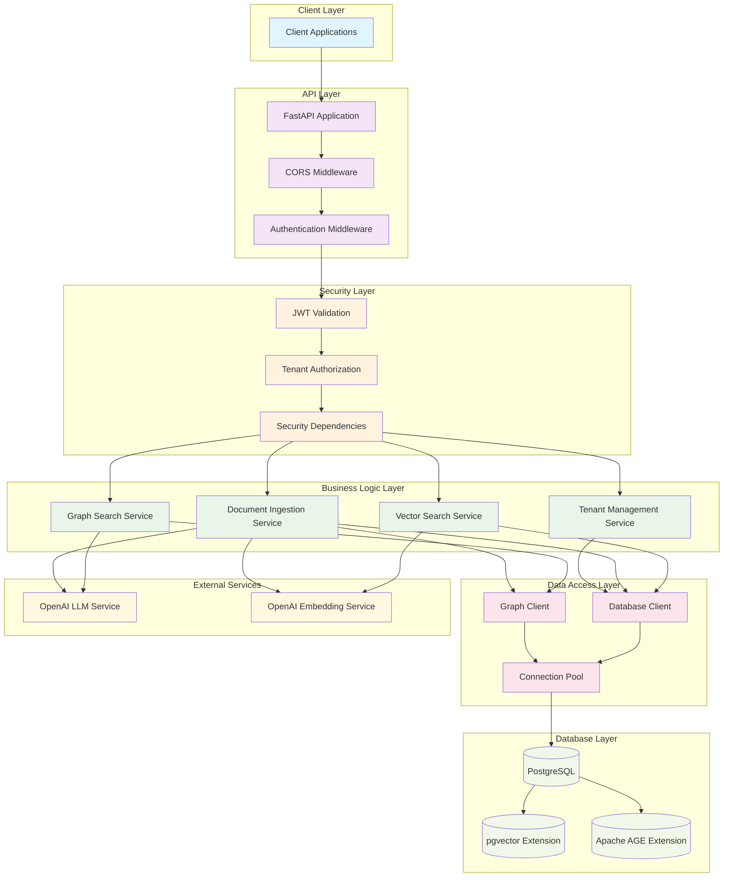

#### Component Interaction Flow

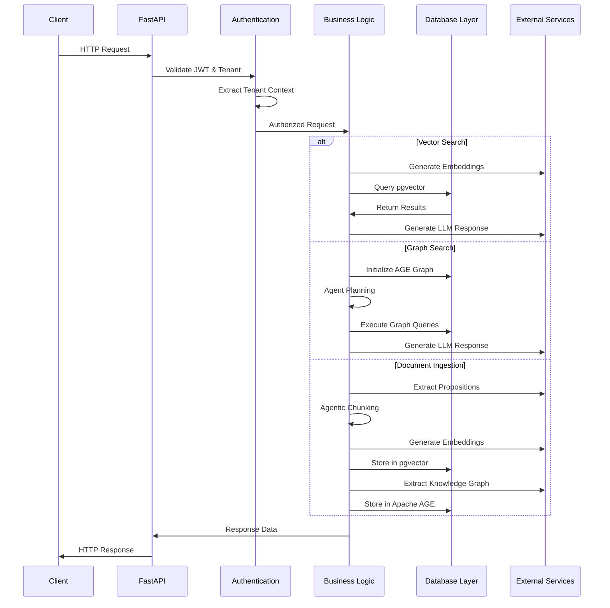

### 2.2 Technology Stack

**Core Framework:**
- **FastAPI**: Modern, high-performance web framework for building APIs
- **Python 3.8+**: Primary programming language
- **Uvicorn**: ASGI server for production deployment

**Database Technologies:**
- **PostgreSQL**: Primary database for data storage and vector operations
- **pgvector**: PostgreSQL extension for vector similarity search
- **Apache AGE**: Graph database extension for PostgreSQL

**AI/ML Components:**
- **LangChain**: Framework for building LLM applications
- **OpenAI API**: External LLM and embedding services
- **LangChain Experimental**: Graph transformers for knowledge extraction

**Security & Authentication:**
- **JWT (JSON Web Tokens)**: Stateless authentication mechanism
- **python-jose**: JWT token handling and validation
- **RS256 Algorithm**: Asymmetric cryptographic signing

### 2.3 Design Principles

**Modularity**: Clear separation between API, business logic, and data layers as demonstrated in [`app/main.py`](app/main.py:1), [`app/services/`](app/services/), and [`app/db/`](app/db/).

**Scalability**: Connection pooling and async processing support high-throughput operations via [`DatabaseClient.get_connection_pool()`](app/db/graph_client.py:29).

**Security**: Multi-layered security with JWT authentication, tenant isolation, and input validation through [`app/core/security.py`](app/core/security.py:1).

**Extensibility**: Plugin-based architecture allows easy addition of new search methods and processing capabilities.

---

## 3. Component Breakdown

### 3.1 API Layer (FastAPI Implementation)

The API layer provides RESTful endpoints built on FastAPI, offering automatic documentation, request validation, and high performance.

**Main Application** ([`app/main.py`](app/main.py:1)):
- FastAPI application initialization with CORS and security middleware
- Tenant context middleware for request tracing and logging
- Health check endpoints and application lifecycle management
- Request ID generation for distributed tracing

**API Router** ([`app/api/v1/api.py`](app/api/v1/api.py:1)):
- Centralized routing configuration
- Global authentication dependencies
- Tenant validation endpoints for debugging and verification

**Key Features:**
- Automatic OpenAPI documentation generation
- Request/response validation using Pydantic models
- Comprehensive error handling and logging
- CORS support for cross-origin requests

### 3.2 Authentication & Security

The security layer implements enterprise-grade authentication and authorization mechanisms.

**JWT Authentication** ([`app/core/security.py`](app/core/security.py:1)):
- RS256 asymmetric key validation for enhanced security
- Header-based tenant context extraction (`x-client-id`, `x-project-id`, `x-workspace-id`)
- Comprehensive user data validation and tenant access control

**Security Features:**
- Public key cryptography for token verification
- Tenant context validation and UUID format checking
- Request-level security with dependency injection
- Detailed security logging for audit trails

**Implementation Details:**
```python
# JWT token validation with tenant context
async def get_current_user(
    authorization: HTTPAuthorizationCredentials = Depends(security),
    x_client_id: Optional[str] = Header(None),
    x_project_id: Optional[str] = Header(None),
    x_workspace_id: Optional[str] = Header(None)
) -> Dict[str, Any]
```

### 3.3 Multi-Tenancy System

The multi-tenancy implementation provides data isolation through a hierarchical client/project/workspace structure.

#### Multi-Tenancy Architecture

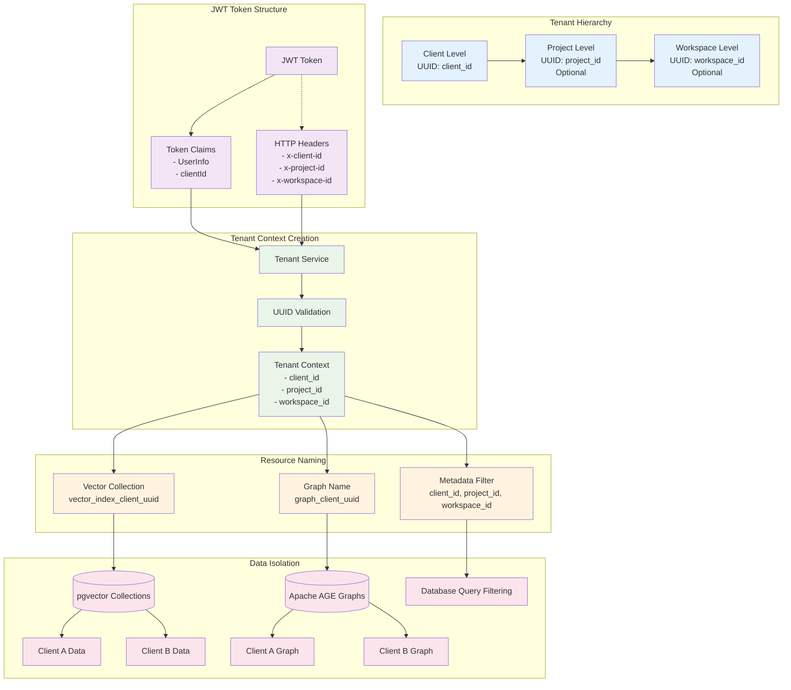

#### Tenant Context Flow

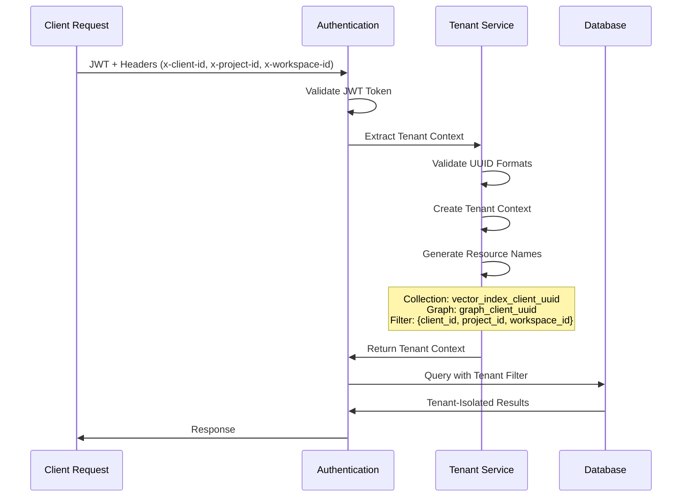

**Tenant Management** ([`app/services/tenant_service.py`](app/services/tenant_service.py:1)):
- UUID validation and conversion utilities
- Tenant context creation from JWT tokens
- Access validation for cross-tenant security

**Tenant Context Model** ([`app/models/schemas.py`](app/models/schemas.py:55)):
- Hierarchical tenant structure with optional project and workspace levels
- Dynamic collection and graph name generation
- Metadata filtering for database queries

**Multi-Tenancy Features:**
- Client-level data isolation with optional project/workspace scoping
- Dynamic resource naming based on tenant hierarchy
- Simplified tenant validation without complex table management
- Backward compatibility with legacy tenant structures

### 3.4 Document Ingestion Pipeline

The ingestion pipeline processes documents through multiple stages using agentic processing techniques.

**Ingestion Endpoints** ([`app/api/v1/endpoints/ingest.py`](app/api/v1/endpoints/ingest.py:1)):
- File upload handling with metadata extraction
- Background task orchestration for async processing
- Status tracking and progress monitoring

**Ingestion Processing** ([`app/tasks/ingestion.py`](app/tasks/ingestion.py:1)):
- Document parsing using Unstructured library
- Proposition extraction using LangChain hub prompts
- Agentic chunking with intelligent content grouping
- Knowledge graph extraction using LLM transformers

**Agentic Chunker** ([`app/tasks/agentic_chunker.py`](app/tasks/agentic_chunker.py:1)):
- Intelligent document segmentation using LLM reasoning
- Dynamic chunk creation based on semantic similarity
- Metadata-aware chunking with tenant context
- Adaptive summarization and title generation

**Processing Workflow:**
1. Document upload and parsing
2. Proposition extraction from text content
3. Agentic chunking with semantic grouping
4. Vector embedding generation and storage
5. Knowledge graph extraction and storage
6. Status tracking and completion notification

### 3.5 Vector Search Component

The vector search component provides semantic similarity search capabilities using pgvector.

**Vector Search Implementation** ([`app/services/vector_search_service.py`](app/services/vector_search_service.py:1)):
- PGVector integration with tenant-specific collections
- Metadata filtering for multi-tenant data isolation
- Similarity search with configurable result limits
- LLM-powered answer generation from retrieved documents

**Key Capabilities:**
- Semantic similarity search using OpenAI embedding service
- Tenant-aware collection management
- Metadata-based filtering for precise results
- Integrated LLM processing for natural language responses

**Search Process:**
1. Query embedding generation via OpenAI embedding service
2. Tenant context validation and collection identification
3. Vector similarity search with metadata filtering
4. Document retrieval and scoring
5. LLM-powered answer synthesis via OpenAI LLM service

### 3.6 Graph Search Component

The graph search component enables relationship-based document retrieval using Apache AGE.

**Graph Search Implementation** ([`app/services/graph_search_service.py`](app/services/graph_search_service.py:1)):
- Apache AGE integration with tenant-specific graphs
- LangChain agent-based graph traversal
- Tool-based graph exploration with schema awareness
- Comprehensive tool call tracking and summarization

**Agent Tools:**
- **Schema Tool**: Graph structure and relationship discovery
- **Node Finder**: Entity identification and property retrieval
- **Neighbor Explorer**: Relationship traversal and connection analysis

**Graph Processing Features:**
- Intelligent graph traversal using ReAct agents
- Multi-step reasoning with tool composition
- Tenant-aware Cypher query generation
- Detailed execution tracking and performance monitoring

### 3.7 Database Layer

The database layer provides unified access to PostgreSQL with pgvector and Apache AGE extensions.

**Database Client** ([`app/db/graph_client.py`](app/db/graph_client.py:1)):
- Connection pooling for optimal performance
- Unified interface for vector and graph operations
- Transaction management with automatic rollback
- Health monitoring and extension validation

**Database Features:**
- Thread-safe connection pooling
- Automatic extension loading (pgvector, Apache AGE)
- Transaction context managers for data consistency
- Comprehensive error handling and logging

**Storage Architecture:**
- Vector embeddings stored in pgvector-enabled tables
- Graph data managed through Apache AGE
- Tenant-specific collections and graphs
- Metadata-based data isolation

---

## 4. Data Flow

### 4.1 Document Ingestion Workflow

The document ingestion process follows a sophisticated pipeline designed for enterprise-scale processing:

#### Document Ingestion Pipeline

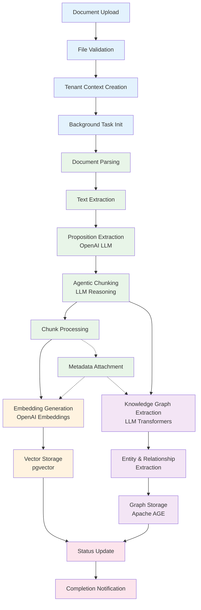

#### Detailed Ingestion Flow

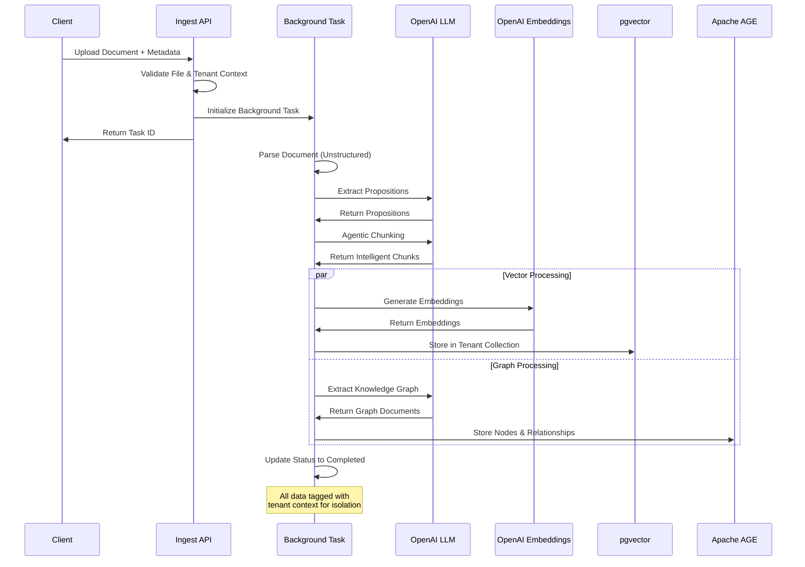

**Detailed Steps:**

1. **Document Reception** ([`ingest.py:18`](app/api/v1/endpoints/ingest.py:18)):
   - File upload validation and metadata extraction
   - Tenant context creation from JWT token
   - Background task initialization with unique task ID

2. **Content Processing** ([`ingestion.py:48`](app/tasks/ingestion.py:48)):
   - Document parsing using Unstructured library
   - Text extraction and proposition generation via OpenAI LLM service
   - Tenant metadata attachment to all content

3. **Agentic Chunking** ([`agentic_chunker.py:33`](app/tasks/agentic_chunker.py:33)):
   - Intelligent content segmentation using OpenAI LLM service reasoning
   - Semantic similarity-based chunk grouping
   - Dynamic metadata generation for each chunk

4. **Vector Storage** ([`ingestion.py:85`](app/tasks/ingestion.py:85)):
   - Embedding generation using OpenAI embedding service
   - Tenant-specific collection storage in pgvector
   - Metadata indexing for efficient retrieval

5. **Graph Extraction** ([`ingestion.py:94`](app/tasks/ingestion.py:94)):
   - Knowledge graph generation using OpenAI LLM service transformers
   - Entity and relationship extraction
   - Tenant context tagging for all graph elements

6. **Graph Storage** ([`ingestion.py:123`](app/tasks/ingestion.py:123)):
   - Apache AGE graph creation and management
   - Cypher query generation for node and relationship creation
   - Transaction-based consistency guarantees

### 4.2 Search and Retrieval Workflows

#### Vector Search Flow

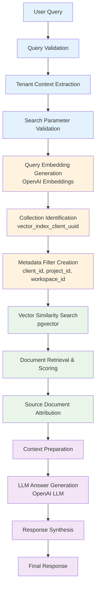

#### Vector Search Sequence

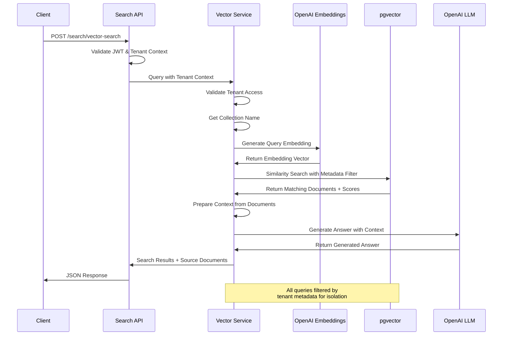

**Process Details:**

1. **Query Processing** ([`search.py:49`](app/api/v1/endpoints/search.py:49)):
   - Query validation and tenant context extraction
   - Search parameter validation and limit enforcement

2. **Vector Search** ([`vector_search_service.py:79`](app/services/vector_search_service.py:79)):
   - Query embedding generation via OpenAI embedding service
   - Tenant-specific collection identification
   - Similarity search with metadata filtering

3. **Response Generation** ([`vector_search_service.py:147`](app/services/vector_search_service.py:147)):
   - Document retrieval and scoring
   - Answer synthesis via OpenAI LLM service
   - Source document attribution

#### Graph Search Flow

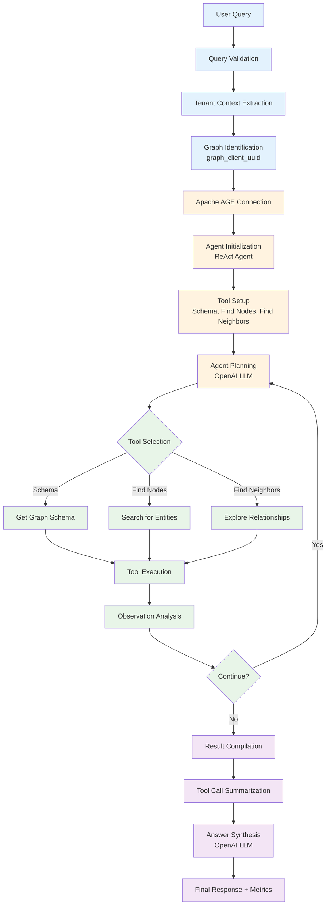

#### Graph Search Sequence

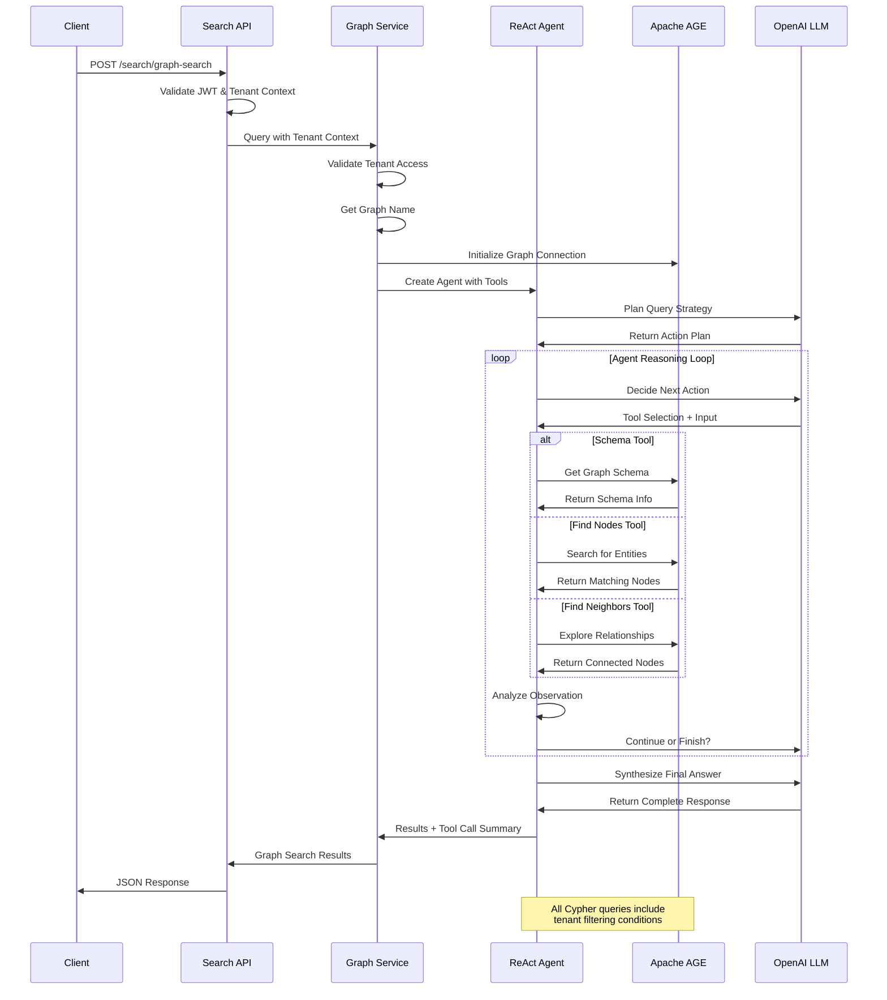

**Process Details:**

1. **Agent Setup** ([`graph_search_service.py:180`](app/services/graph_search_service.py:180)):
   - Tenant context validation and graph identification
   - Apache AGE connection establishment
   - Agent tool initialization

2. **Intelligent Traversal** ([`graph_search_service.py:264`](app/services/graph_search_service.py:264)):
   - ReAct agent reasoning and planning via OpenAI LLM service
   - Tool-based graph exploration
   - Multi-step relationship discovery

3. **Result Compilation** ([`graph_search_service.py:275`](app/services/graph_search_service.py:275)):
   - Tool call summarization
   - Answer synthesis from graph data
   - Performance metrics collection

---

## 5. API Endpoints

### 5.1 Authentication Endpoints

**Tenant Validation**
```http
GET /tenant/validate
Authorization: Bearer <jwt_token>
Headers:
  x-client-id: <client_uuid>
  x-project-id: <project_uuid> (optional)
  x-workspace-id: <workspace_uuid> (optional)
```

**Response:**
```json
{
  "status": "valid",
  "tenant_context": {
    "client_id": "uuid",
    "project_id": "uuid",
    "workspace_id": "uuid"
  },
  "collection_name": "vector_index_client_uuid",
  "graph_name": "graph_client_uuid"
}
```

**Tenant Information**
```http
GET /tenant/info
Authorization: Bearer <jwt_token>
Headers:
  x-client-id: <client_uuid>
```

### 5.2 Document Ingestion Endpoints

**Document Upload**
```http
POST /ingest/
Authorization: Bearer <jwt_token>
Headers:
  x-client-id: <client_uuid>
  x-project-id: <project_uuid> (optional)
  x-workspace-id: <workspace_uuid> (optional)
Content-Type: multipart/form-data

Body:
  file: <document_file>
  metadata: <json_metadata> (optional)
  create_knowledge_graph: <boolean> (default: true)
```

**Response:**
```json
{
  "task_id": "uuid",
  "status": "pending",
  "message": "Document ingestion has been initiated."
}
```

**Ingestion Status Check**
```http
GET /ingest/status/{task_id}
Authorization: Bearer <jwt_token>
```

**Response:**
```json
{
  "task_id": "uuid",
  "status": "completed|in_progress|failed",
  "details": "Status description"
}
```

### 5.3 Search Endpoints

**Vector Search**
```http
POST /search/vector-search
Authorization: Bearer <jwt_token>
Headers:
  x-client-id: <client_uuid>
  x-project-id: <project_uuid> (optional)
  x-workspace-id: <workspace_uuid> (optional)
Content-Type: application/json

Body:
{
  "query": "search query string",
  "limit": 5
}
```

**Response:**
```json
{
  "source": "vector",
  "result": {
    "query": "search query",
    "result": "Generated answer",
    "source_documents": [
      {
        "page_content": "document content",
        "metadata": {
          "client_id": "uuid",
          "source": "filename",
          "similarity_score": 0.95
        }
      }
    ]
  }
}
```

**Graph Search**
```http
POST /search/graph-search
Authorization: Bearer <jwt_token>
Headers:
  x-client-id: <client_uuid>
Content-Type: application/json

Body:
{
  "query": "relationship query",
  "max_iterations": 10
}
```

**Response:**
```json
{
  "source": "graph",
  "result": "Generated answer from graph traversal",
  "tool_call_summary": {
    "total_calls": 5,
    "tool_calls": [
      {
        "tool_name": "find_nodes",
        "input_data": "search term",
        "output_data": "found nodes",
        "timestamp": "2025-08-25T21:00:00Z",
        "execution_time_ms": 150.5
      }
    ]
  }
}
```

### 5.4 Health Check Endpoints

**Application Health**
```http
GET /health
```

**Response:**
```json
{
  "status": "healthy",
  "timestamp": 1692998400.0,
  "version": "1.0.0",
  "environment": "development"
}
```

**Root Information**
```http
GET /
```

**Response:**
```json
{
  "message": "Welcome to FastRAG POC API",
  "version": "1.0.0",
  "docs": "/docs",
  "multi_tenancy": "simplified",
  "status": "running"
}
```

---

## 6. Security Implementation

### 6.1 Authentication Architecture

The Fast-RAG-App implements a robust JWT-based authentication system designed for enterprise security requirements.

#### Authentication Flow Diagram

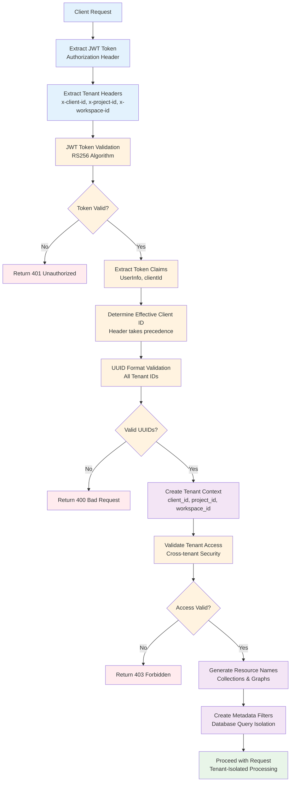

#### JWT Authentication Sequence

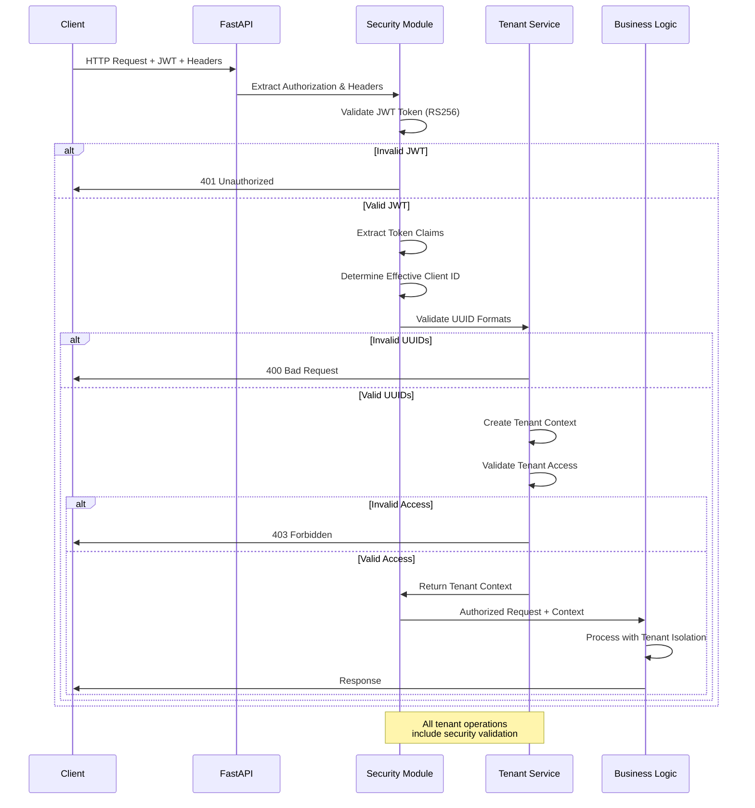

**JWT Token Structure:**
- **Algorithm**: RS256 (RSA Signature with SHA-256)
- **Public Key Validation**: Asymmetric cryptography for enhanced security
- **Token Claims**: User information and client context
- **Header Support**: Additional tenant context via HTTP headers

**Authentication Flow:**
1. Client presents JWT token in Authorization header
2. Token validation using configured public key
3. Tenant context extraction from token and headers
4. Access validation for requested resources
5. Request processing with tenant isolation

### 6.2 Authorization and Tenant Isolation

**Multi-Level Authorization:**
- **Token-Level**: JWT signature and expiration validation
- **Tenant-Level**: Client ID matching between token and headers
- **Resource-Level**: Tenant-specific data access controls

**Tenant Isolation Mechanisms:**
- **Collection Isolation**: Tenant-specific vector collections
- **Graph Isolation**: Tenant-specific Apache AGE graphs
- **Metadata Filtering**: Database-level tenant filtering
- **UUID Validation**: Strict format validation for all tenant identifiers

**Implementation Details** ([`app/core/security.py`](app/core/security.py:14)):
```python
async def get_current_user(
    authorization: HTTPAuthorizationCredentials = Depends(security),
    x_client_id: Optional[str] = Header(None),
    x_project_id: Optional[str] = Header(None),
    x_workspace_id: Optional[str] = Header(None)
) -> Dict[str, Any]:
    # JWT validation and tenant context extraction
    # Returns validated user data with tenant context
```

### 6.3 Security Best Practices

**Input Validation:**
- Pydantic model validation for all API inputs
- UUID format validation for tenant identifiers
- File type and size validation for document uploads
- SQL injection prevention through parameterized queries

**Error Handling:**
- Sanitized error messages to prevent information disclosure
- Comprehensive logging for security audit trails
- Rate limiting considerations for production deployment
- Graceful degradation for service failures

**Data Protection:**
- Tenant data isolation at database level
- Encrypted connections to external services
- Secure credential management via environment variables
- Audit logging for all tenant operations

---

## 7. Configuration & Deployment

### 7.1 Environment Configuration

The application uses environment-based configuration management through [`app/core/config.py`](app/core/config.py:1).

**Required Environment Variables:**

**Database Configuration:**
```bash
POSTGRES_HOST=localhost
POSTGRES_PORT=5432
POSTGRES_DB=fast_rag_db
POSTGRES_USER=postgres
POSTGRES_PASSWORD=your_password
POSTGRES_VECTOR_DIMENSION=1536
```

**OpenAI Service Configuration:**
```bash
OPENAI_API_BASE=https://api.openai.com/v1
EMBEDDING_MODEL_URL=https://api.openai.com/v1
OPENAI_API_KEY=your_openai_api_key
EMBEDDING_MODEL_NAME=text-embedding-3-large
INGESTION_LLM_MODEL_NAME=gpt-4o
QUERY_LLM_MODEL_NAME=claude-3-5-sonnet-v2@20241022
```

**Security Configuration:**
```bash
JWT_PUBLIC_KEY=your_rsa_public_key
JWT_ALGORITHM=RS256
```

**Application Settings:**
```bash
PROJECT_NAME=FastRAG POC API
ENVIRONMENT=development
DEBUG=true
LOG_LEVEL=INFO
ENABLE_TENANT_ISOLATION=false
```

### 7.2 Database Setup

**PostgreSQL Extensions:**
```sql
-- Enable required extensions
CREATE EXTENSION IF NOT EXISTS vector;
CREATE EXTENSION IF NOT EXISTS age;

-- Load AGE extension
LOAD 'age';
SET search_path = ag_catalog, "$user", public;
```

**Database Initialization:**
The application automatically handles:
- Connection pool creation
- Extension validation
- Tenant-specific collection and graph creation
- Health monitoring

### 7.3 Deployment Architecture

**Development Setup:**
```bash
# Virtual environment setup
python -m venv venv
source venv/bin/activate  # On Windows: venv\Scripts\activate

# Install dependencies
pip install -r requirements.txt

# Run application
python -m uvicorn app.main:app --reload
```

**Production Considerations:**
- **Container Deployment**: Docker containerization for consistent environments
- **Load Balancing**: Multiple application instances behind load balancer
- **Database Scaling**: PostgreSQL clustering for high availability
- **Monitoring**: Application performance monitoring and logging
- **Security**: HTTPS termination and network security

**Performance Tuning:**
- Connection pool sizing based on expected load
- Vector search result limits to prevent resource exhaustion
- Graph search iteration limits for query timeout prevention
- Background task queue management for ingestion processing

### 7.4 Monitoring and Observability

**Application Logging:**
- Structured logging with tenant context
- Request tracing with unique request IDs
- Performance metrics for search operations
- Error tracking and alerting

**Health Monitoring:**
- Database connection health checks
- Extension availability validation
- External service connectivity monitoring
- Resource utilization tracking

---

## 8. Future Enhancements

### 8.1 Planned Improvements

**Enhanced Multi-Tenancy:**
- Full project and workspace-level isolation
- Hierarchical access controls and permissions
- Tenant-specific configuration management
- Advanced tenant analytics and usage tracking

**Performance Optimizations:**
- Caching layer for frequently accessed data
- Optimized vector indexing strategies
- Graph query optimization and caching
- Parallel processing for large document ingestion

**Advanced Search Capabilities:**
- Hybrid search combining vector and graph results
- Semantic filtering and faceted search
- Real-time search result updates
- Advanced query language support

### 8.2 Scalability Enhancements

**Distributed Architecture:**
- Microservices decomposition for independent scaling
- Message queue integration for async processing
- Distributed caching with Redis
- Container orchestration with Kubernetes

**Data Management:**
- Automated data archiving and lifecycle management
- Cross-region data replication
- Backup and disaster recovery procedures
- Data retention policy enforcement

### 8.3 Integration Capabilities

**External System Integration:**
- Enterprise SSO integration (SAML, OIDC)
- Document management system connectors
- Business intelligence and analytics integration
- Webhook support for real-time notifications

**API Enhancements:**
- GraphQL API for flexible data querying
- Streaming API for real-time updates
- Batch processing APIs for bulk operations
- Advanced filtering and sorting capabilities

### 8.4 AI/ML Improvements

**Advanced Processing:**
- Custom embedding models for domain-specific content
- Multi-modal document processing (text, images, tables)
- Automated content classification and tagging
- Intelligent document summarization

**Enhanced Reasoning:**
- Multi-agent collaboration for complex queries
- Reasoning chain visualization and explanation
- Confidence scoring for search results
- Adaptive learning from user feedback

---

## Conclusion

The Fast-RAG-App represents a comprehensive enterprise-level solution for intelligent document retrieval, combining the power of vector search and graph-based reasoning with robust multi-tenancy and security features. The modular architecture ensures scalability and maintainability while providing the flexibility needed for diverse enterprise requirements.

The system's design emphasizes:
- **Enterprise Security**: Comprehensive authentication and tenant isolation
- **Intelligent Processing**: Agentic document chunking and graph extraction
- **Dual Search Capabilities**: Both semantic and relationship-based retrieval
- **Scalable Architecture**: PostgreSQL-based foundation with modern extensions
- **Developer Experience**: Comprehensive API documentation and monitoring

This documentation serves as the definitive guide for developers, architects, and technical stakeholders working with the Fast-RAG-App system, providing the necessary technical details and implementation guidance for successful deployment and operation.
