# FastAPI RAG Application - Comprehensive Design Document

## Table of Contents
1. [Executive Summary](#executive-summary)
2. [System Architecture Overview](#system-architecture-overview)
3. [Component Architecture](#component-architecture)
4. [Database Schema Design](#database-schema-design)
5. [API Flow Diagrams](#api-flow-diagrams)
6. [Data Flow Diagrams](#data-flow-diagrams)
7. [Sequence Diagrams](#sequence-diagrams)
8. [Multi-Tenant Architecture](#multi-tenant-architecture)
9. [Technology Stack](#technology-stack)
10. [Deployment Architecture](#deployment-architecture)
11. [Security Architecture](#security-architecture)
12. [Performance Considerations](#performance-considerations)

---

## Executive Summary

The FastAPI RAG (Retrieval-Augmented Generation) application is an enterprise-level document ingestion and retrieval system that combines vector similarity search with graph-based knowledge retrieval. The system features a sophisticated multi-tenant architecture, JWT-based authentication, and intelligent document processing with agentic chunking.

### Key Features
- **Dual Search Capabilities**: Vector similarity search using pgvector and graph-based search using Apache AGE
- **Multi-Tenant Architecture**: Hierarchical tenant isolation with client/project/workspace scoping
- **Intelligent Document Processing**: Proposition extraction and agentic chunking for optimal retrieval
- **Background Processing**: Asynchronous document ingestion with status tracking
- **Enterprise Security**: JWT authentication with RS256 algorithm and tenant validation

---

## System Architecture Overview

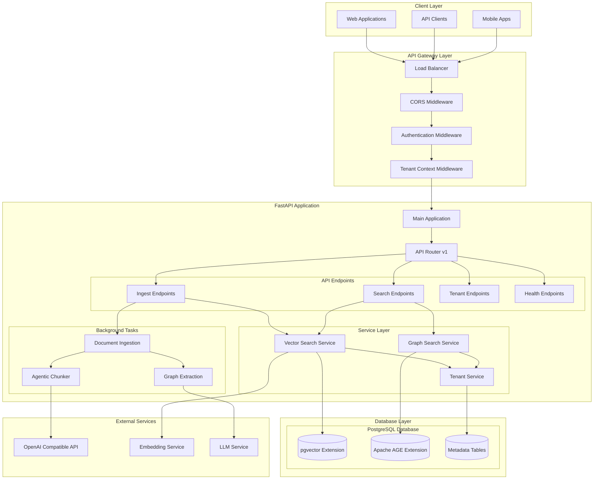

### Architecture Principles
- **Layered Architecture**: Clear separation between API, service, and data layers
- **Microservice-Ready**: Modular design that can be easily decomposed
- **Tenant Isolation**: Comprehensive multi-tenancy with data segregation
- **Async Processing**: Background tasks for resource-intensive operations
- **Extensibility**: Plugin architecture for different LLM providers

---

## Component Architecture

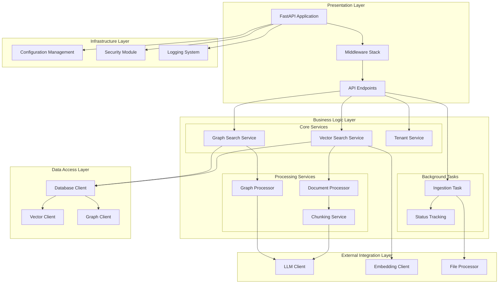

### Component Responsibilities

#### Presentation Layer
- **FastAPI Application**: Main application entry point and routing
- **Middleware Stack**: CORS, authentication, tenant context, and logging
- **API Endpoints**: RESTful endpoints for ingestion, search, and management

#### Business Logic Layer
- **Vector Search Service**: Semantic similarity search using embeddings
- **Graph Search Service**: Knowledge graph querying with Cypher
- **Tenant Service**: Multi-tenant context management and validation
- **Document Processor**: File parsing and content extraction
- **Chunking Service**: Intelligent document segmentation
- **Graph Processor**: Knowledge graph extraction from documents

#### Data Access Layer
- **Database Client**: Unified PostgreSQL connection management
- **Vector Client**: pgvector operations and collection management
- **Graph Client**: Apache AGE graph operations and query execution

---

## Database Schema Design

### Vector Database Schema (pgvector)

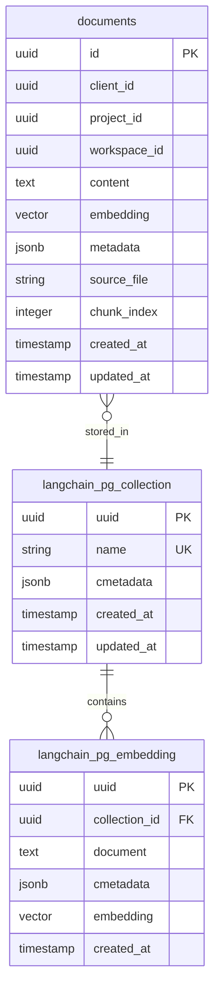

### Graph Database Schema (Apache AGE)

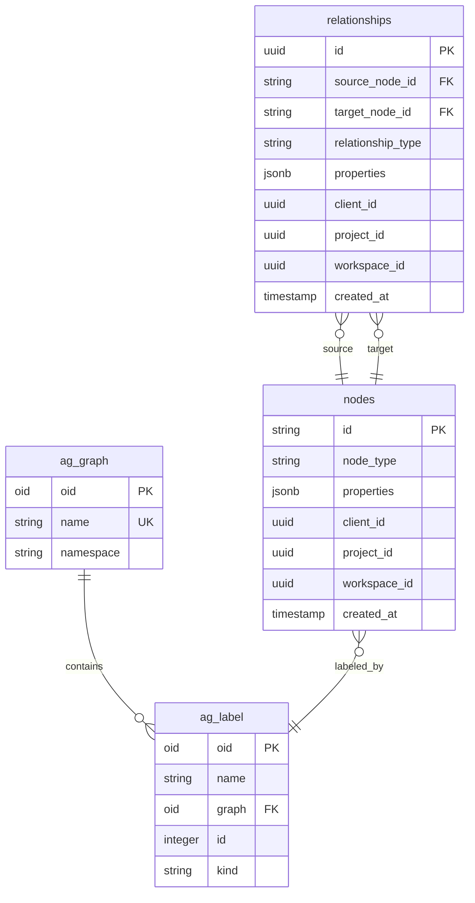

### Multi-Tenant Data Model

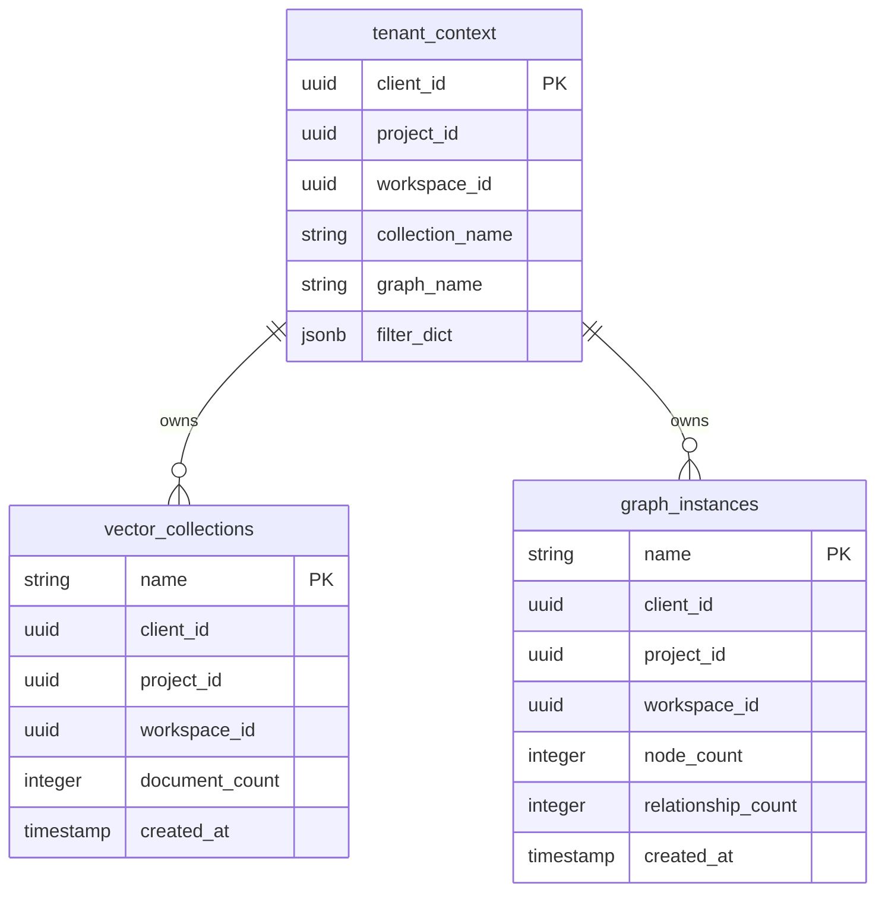

---

## API Flow Diagrams

### Authentication Flow

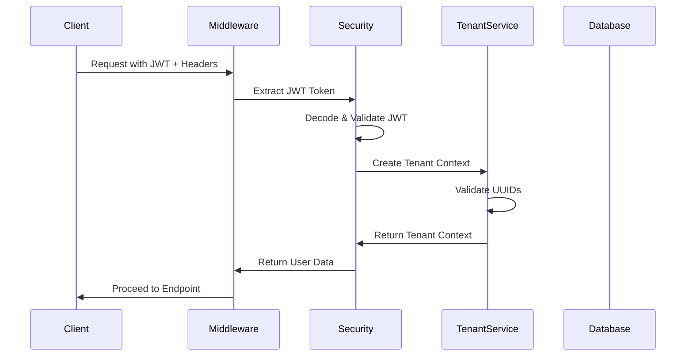

### Ingestion API Flow

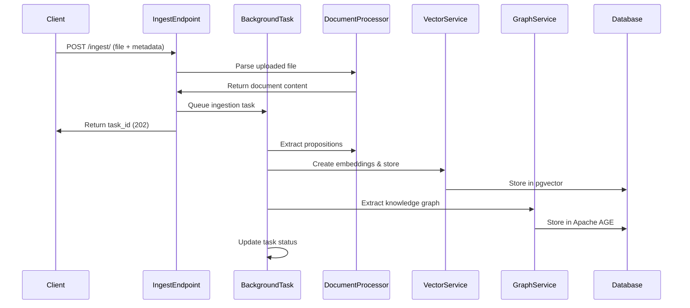

### Search API Flow

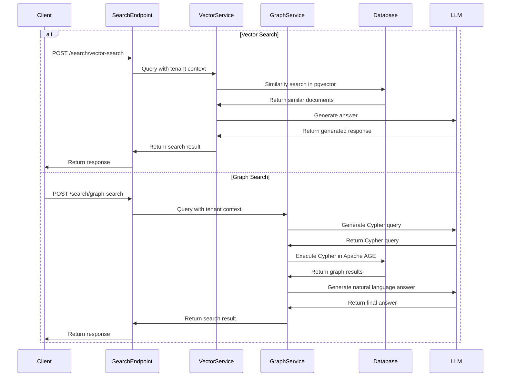

---

## Data Flow Diagrams

### Document Ingestion Pipeline

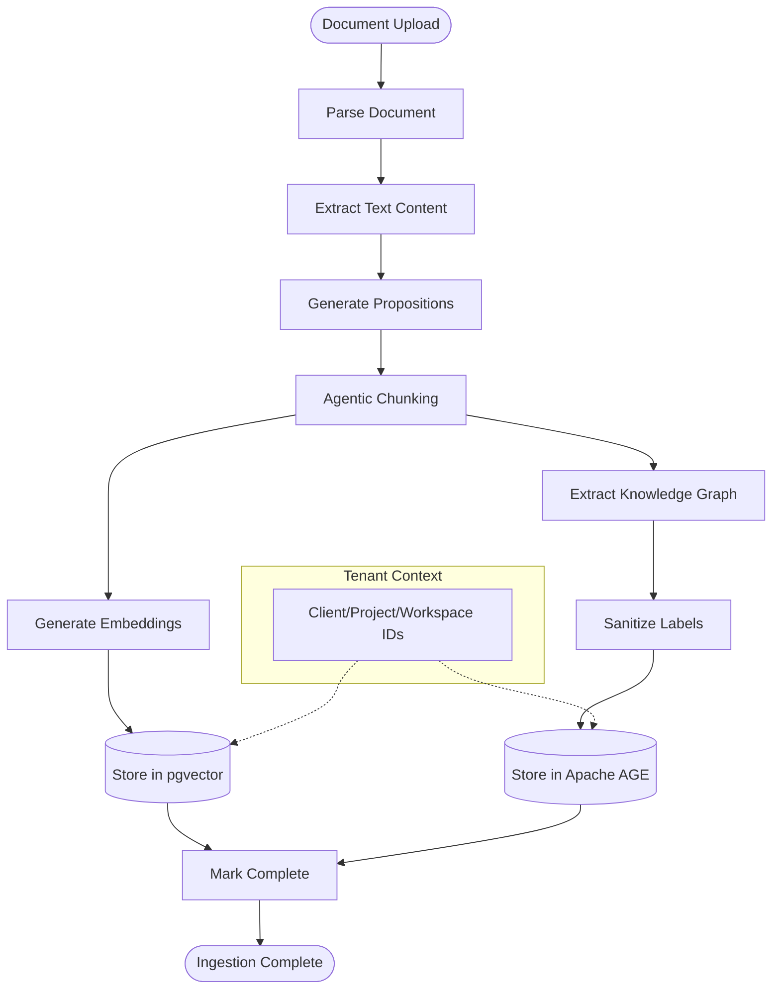

### Vector Search Workflow

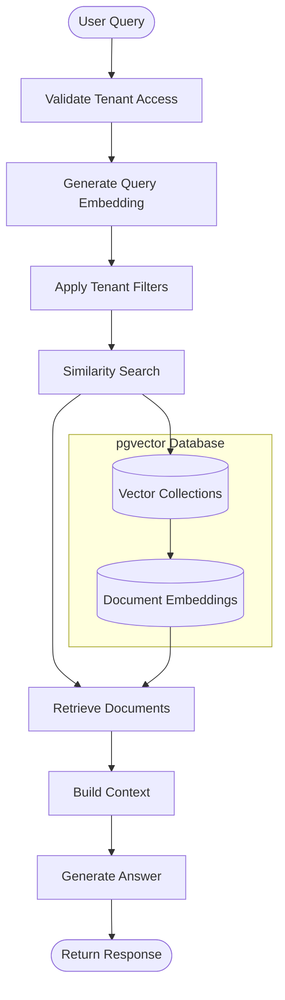

### Graph Search Workflow

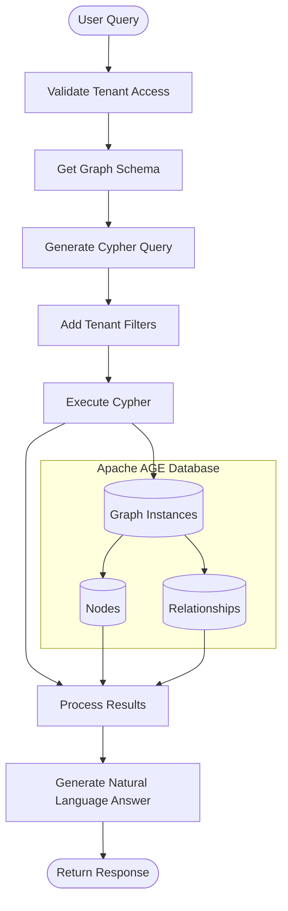

---

## Sequence Diagrams

### Document Ingestion Process

```mermaid
sequenceDiagram
    participant User
    participant API
    participant BackgroundTask
    participant AgenticChunker
    participant VectorDB
    participant GraphExtractor
    participant GraphDB
    participant LLM
    
    User->>API: Upload Document
    API->>BackgroundTask: Queue Ingestion Task
    API->>User: Return Task ID
    
    BackgroundTask->>LLM: Extract
Propositions
    LLM->>BackgroundTask: Return Propositions
    BackgroundTask->>AgenticChunker: Process Propositions
    AgenticChunker->>LLM: Generate Chunk Summaries
    LLM->>AgenticChunker: Return Summaries
    AgenticChunker->>BackgroundTask: Return Chunks
    
    BackgroundTask->>VectorDB: Store Embeddings
    VectorDB->>BackgroundTask: Confirm Storage
    
    BackgroundTask->>GraphExtractor: Extract Knowledge Graph
    GraphExtractor->>LLM: Process Document
    LLM->>GraphExtractor: Return Graph Elements
    GraphExtractor->>GraphDB: Store Nodes & Relationships
    GraphDB->>BackgroundTask: Confirm Storage
    
    BackgroundTask->>API: Update Task Status
```

### Vector Search Operation

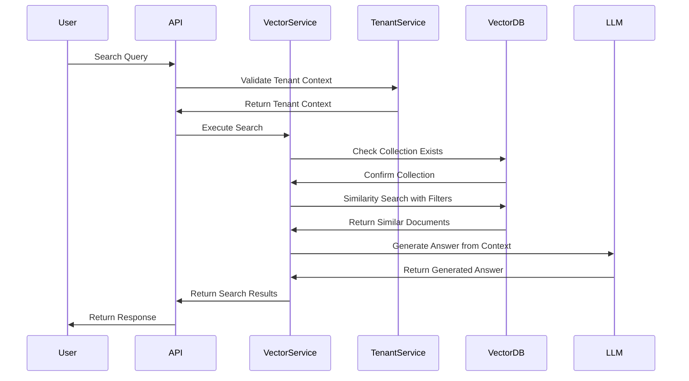

### Graph Search Operation

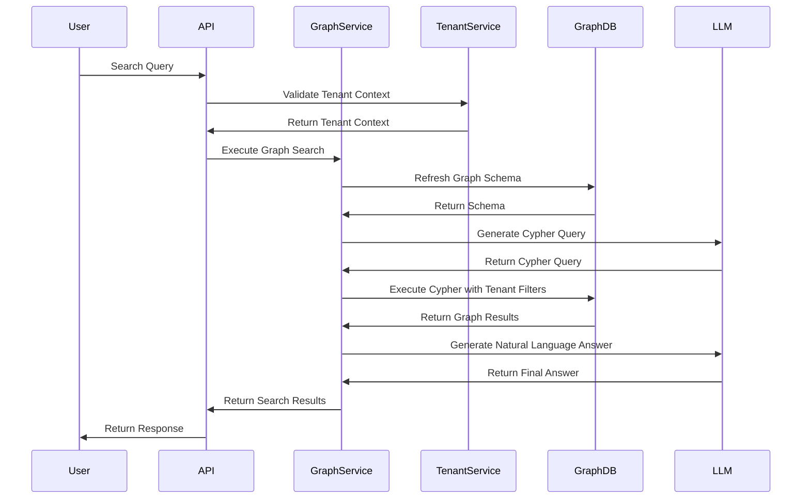

### Tenant Validation Process

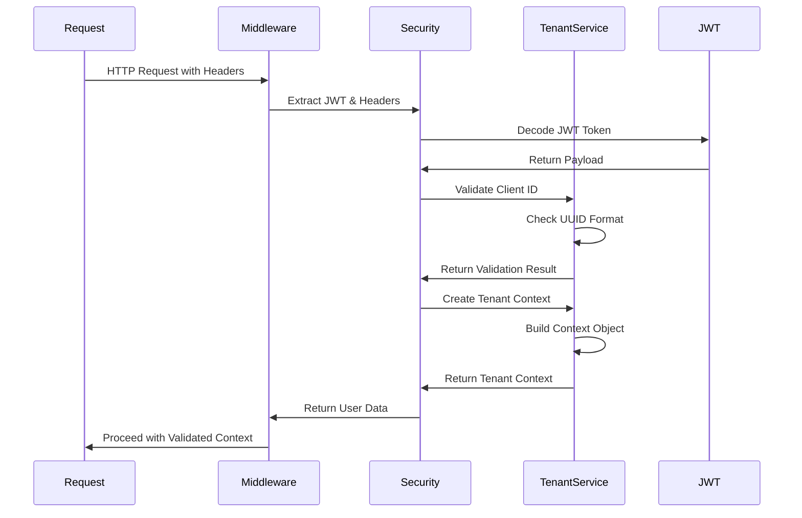

---

## Multi-Tenant Architecture

### Tenant Isolation Model

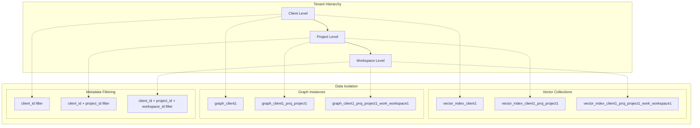

### Tenant Context Flow

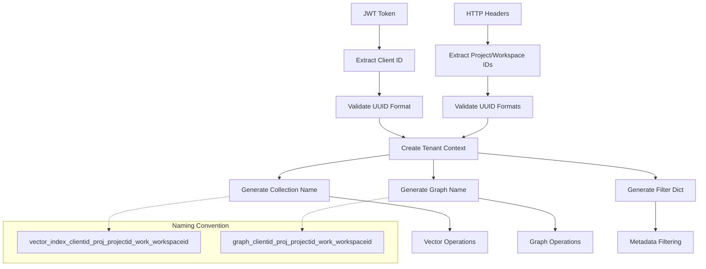

### Multi-Tenant Security Model

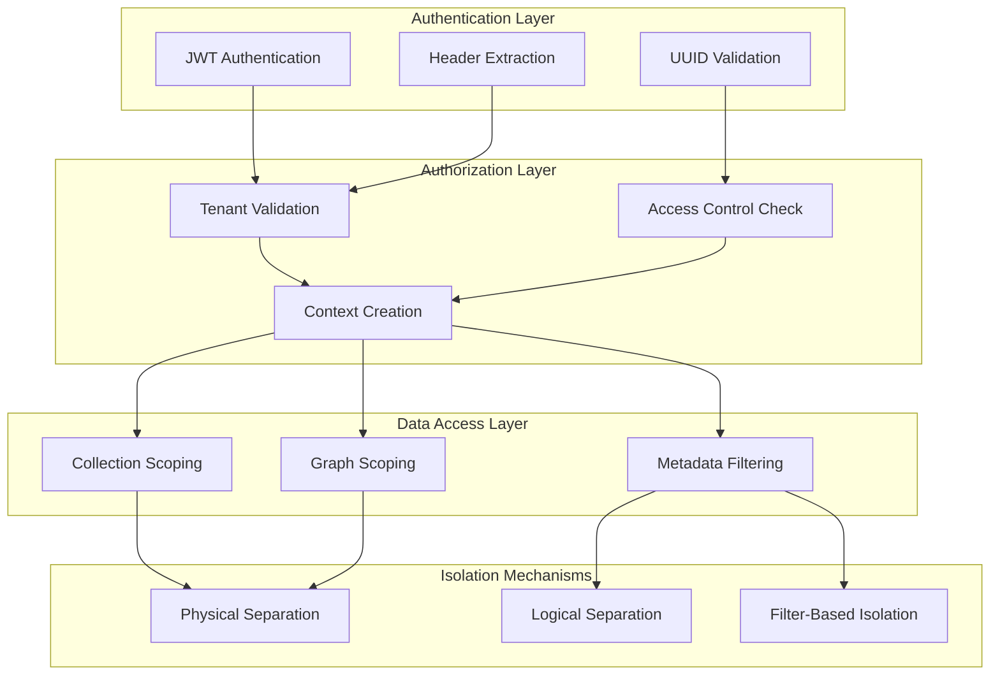

---

## Technology Stack

### Technology Stack Overview

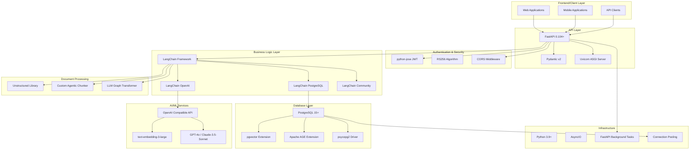

### Technology Dependencies

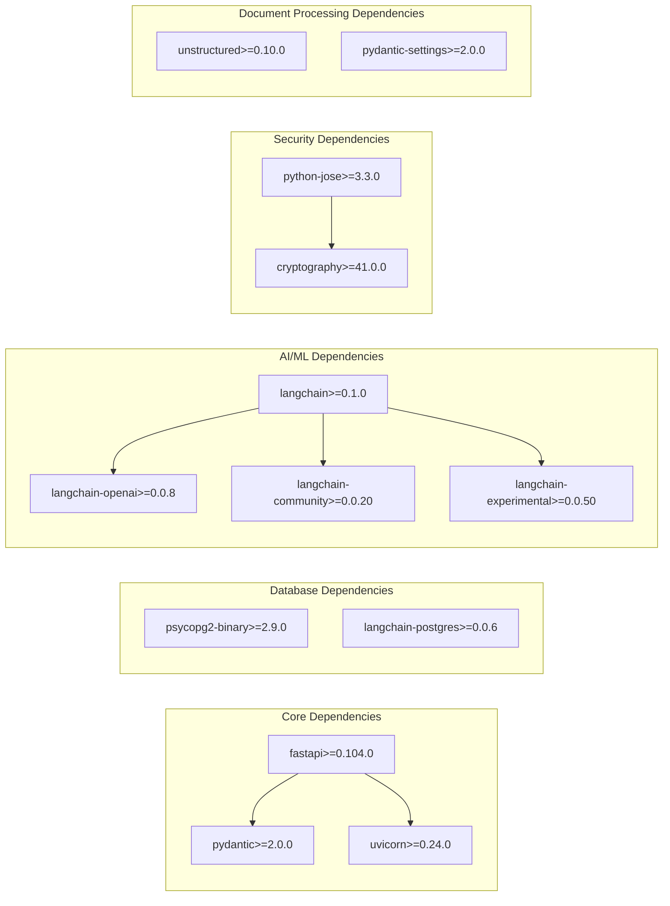

---

## Deployment Architecture

### Container Architecture

```mermaid
graph TB
    subgraph "Load Balancer"
        LB[NGINX/HAProxy]
    end
    
    subgraph "Application Tier"
        subgraph "FastAPI Containers"
            APP1[FastAPI App 1]
            APP2[FastAPI App 2]
            APP3[FastAPI App N]
        end
        
        subgraph "Background Workers"
            WORKER1[Background Worker 1]
            WORKER2[Background Worker 2]
        end
    end
    
    subgraph "Database Tier"
        subgraph "PostgreSQL Cluster"
            PG_PRIMARY[PostgreSQL Primary]
            PG_REPLICA1[PostgreSQL Replica 1]
            PG_REPLICA2[PostgreSQL Replica 2]
        end
        
        subgraph "Extensions"
            PGVECTOR_EXT[pgvector Extension]
            AGE_EXT[Apache AGE Extension]
        end
    end
    
    subgraph "External Services"
        OPENAI_SVC[OpenAI Compatible API]
        MONITORING[Monitoring Stack]
        LOGGING[Centralized Logging]
    end
    
    LB --> APP1
    LB --> APP2
    LB --> APP3
    
    APP1 --> PG_PRIMARY
    APP2 --> PG_PRIMARY
    APP3 --> PG_PRIMARY
    
    APP1 -.-> PG_REPLICA1
    APP2 -.-> PG_REPLICA2
    
    WORKER1 --> PG_PRIMARY
    WORKER2 --> PG_PRIMARY
    
    PG_PRIMARY --> PGVECTOR_EXT
    PG_PRIMARY --> AGE_EXT
    
    APP1 --> OPENAI_SVC
    APP2 --> OPENAI_SVC
    APP3 --> OPENAI_SVC
    
    APP1 --> MONITORING
    APP2 --> MONITORING
    APP3 --> MONITORING
    
    APP1 --> LOGGING
    APP2 --> LOGGING
    APP3 --> LOGGING
```

### Kubernetes Deployment

```mermaid
graph TB
    subgraph "Kubernetes Cluster"
        subgraph "Ingress"
            INGRESS[Ingress Controller]
            TLS[TLS Termination]
        end
        
        subgraph "Application Namespace"
            subgraph "FastAPI Deployment"
                FASTAPI_POD1[FastAPI Pod 1]
                FASTAPI_POD2[FastAPI Pod 2]
                FASTAPI_POD3[FastAPI Pod 3]
            end
            
            subgraph "Worker Deployment"
                WORKER_POD1[Worker Pod 1]
                WORKER_POD2[Worker Pod 2]
            end
            
            subgraph "Services"
                FASTAPI_SVC[FastAPI Service]
                WORKER_SVC[Worker Service]
            end
        end
        
        subgraph "Database Namespace"
            subgraph "PostgreSQL StatefulSet"
                PG_POD1[PostgreSQL Primary]
                PG_POD2[PostgreSQL Replica]
            end
            
            subgraph "Storage"
                PVC1[Persistent Volume 1]
                PVC2[Persistent Volume 2]
            end
        end
        
        subgraph "Configuration"
            CONFIG_MAP[ConfigMap]
            SECRETS[Secrets]
        end
    end
    
    INGRESS --> FASTAPI_SVC
    FASTAPI_SVC --> FASTAPI_POD1
    FASTAPI_SVC --> FASTAPI_POD2
    FASTAPI_SVC --> FASTAPI_POD3
    
    WORKER_SVC --> WORKER_POD1
    WORKER_SVC --> WORKER_POD2
    
    FASTAPI_POD1 --> PG_POD1
    FASTAPI_POD2 --> PG_POD1
    FASTAPI_POD3 --> PG_POD1
    
    WORKER_POD1 --> PG_POD1
    WORKER_POD2 --> PG_POD1
    
    PG_POD1 --> PVC1
    PG_POD2 --> PVC2
    
    FASTAPI_POD1 --> CONFIG_MAP
    FASTAPI_POD2 --> CONFIG_MAP
    FASTAPI_POD3 --> CONFIG_MAP
    
    FASTAPI_POD1 --> SECRETS
    FASTAPI_POD2 --> SECRETS
    FASTAPI_POD3 --> SECRETS
```

### Environment Configuration

```mermaid
graph TB
    subgraph "Development Environment"
        DEV_API[FastAPI Dev Server]
        DEV_DB[Local PostgreSQL]
        DEV_CONFIG[.env Configuration]
    end
    
    subgraph "Staging Environment"
        STAGE_API[FastAPI Staging]
        STAGE_DB[Staging PostgreSQL]
        STAGE_CONFIG[Environment Variables]
    end
    
    subgraph "Production Environment"
        PROD_LB[Production Load Balancer]
        PROD_API[FastAPI Production Cluster]
        PROD_DB[Production PostgreSQL Cluster]
        PROD_CONFIG[Kubernetes Secrets]
    end
    
    DEV_API --> DEV_DB
    DEV_API --> DEV_CONFIG
    
    STAGE_API --> STAGE_DB
    STAGE_API --> STAGE_CONFIG
    
    PROD_LB --> PROD_API
    PROD_API --> PROD_DB
    PROD_API --> PROD_CONFIG
```

---

## Security Architecture

### Authentication & Authorization Flow

```mermaid
sequenceDiagram
    participant Client
    participant Gateway
    participant FastAPI
    participant JWT_Service
    participant TenantService
    participant Database
    
    Client->>Gateway: Request with JWT Token
    Gateway->>FastAPI: Forward Request
    FastAPI->>JWT_Service: Validate JWT Token
    JWT_Service->>JWT_Service: Verify RS256 Signature
    JWT_Service->>FastAPI: Return Token Payload
    
    FastAPI->>TenantService: Extract Tenant Context
    TenantService->>TenantService: Validate UUID Formats
    TenantService->>TenantService: Create Tenant Context
    TenantService->>FastAPI: Return Validated Context
    
    FastAPI->>Database: Execute Query with Tenant Filters
    Database->>FastAPI: Return Filtered Results
    FastAPI->>Client: Return Response
```

### Security Layers

```mermaid
graph TB
    subgraph "Network Security"
        TLS[TLS 1.3 Encryption]
        FIREWALL[Network Firewall]
        VPC[Virtual Private Cloud]
    end
    
    subgraph "Application Security"
        JWT_AUTH[JWT Authentication]
        CORS_POLICY[CORS Policy]
        RATE_LIMIT[Rate Limiting]
        INPUT_VALID[Input Validation]
    end
    
    subgraph "Data Security"
        TENANT_ISOLATION[Tenant Isolation]
        DATA_ENCRYPT[Data Encryption at Rest]
        CONN_ENCRYPT[Connection Encryption]
        ACCESS_CONTROL[Access Control]
    end
    
    subgraph "Infrastructure Security"
        CONTAINER_SEC[Container Security]
        SECRET_MGMT[Secret Management]
        AUDIT_LOG[Audit Logging]
        MONITORING[Security Monitoring]
    end
    
    TLS --> JWT_AUTH
    FIREWALL --> CORS_POLICY
    VPC --> RATE_LIMIT
    
    JWT_AUTH --> TENANT_ISOLATION
    INPUT_VALID --> DATA_ENCRYPT
    
    TENANT_ISOLATION --> CONTAINER_SEC
    ACCESS_CONTROL --> SECRET_MGMT
```

### Data Protection Model

```mermaid
graph TB
    subgraph "Data Classification"
        PUBLIC[Public Data]
        INTERNAL[Internal Data]
        CONFIDENTIAL[Confidential Data]
        RESTRICTED[Restricted Data]
    end
    
    subgraph "Protection Mechanisms"
        ENCRYPTION[AES-256 Encryption]
        TOKENIZATION[Data Tokenization]
        MASKING[Data Masking]
        ANONYMIZATION[Data Anonymization]
    end
    
    subgraph "Access Controls"
        RBAC[Role-Based Access Control]
        ABAC[Attribute-Based Access Control]
        TENANT_FILTER[Tenant-Based Filtering]
        API_KEYS[API Key Management]
    end
    
    subgraph "Compliance"
        GDPR[GDPR Compliance]
        SOC2[SOC 2 Compliance]
        AUDIT_TRAIL[Audit Trail]
        DATA_RETENTION[Data Retention Policies]
    end
    
    CONFIDENTIAL --> ENCRYPTION
    RESTRICTED --> TOKENIZATION
    INTERNAL --> MASKING
    
    ENCRYPTION --> RBAC
    TOKENIZATION --> ABAC
    MASKING --> TENANT_FILTER
    
    RBAC --> GDPR
    TENANT_FILTER --> SOC2
    API_KEYS --> AUDIT_TRAIL
```

---

## Performance Considerations

### Performance Architecture

```mermaid
graph TB
    subgraph "Caching Strategy"
        REDIS[Redis Cache]
        APP_CACHE[Application Cache]
        DB_CACHE[Database Query Cache]
        EMBEDDING_CACHE[Embedding Cache]
    end
    
    subgraph "Database Optimization"
        CONN_POOL[Connection Pooling]
        READ_REPLICA[Read Replicas]
        INDEX_OPT[Index Optimization]
        QUERY_OPT[Query Optimization]
    end
    
    subgraph "Application Optimization"
        ASYNC_PROC[Async Processing]
        BACKGROUND_TASKS[Background Tasks]
        BATCH_PROC[Batch Processing]
        LAZY_LOAD[Lazy Loading]
    end
    
    subgraph "Infrastructure Optimization"
        LOAD_BALANCE[Load Balancing]
        AUTO_SCALE[Auto Scaling]
        CDN[Content Delivery Network]
        MONITORING[Performance Monitoring]
    end
    
    REDIS --> CONN_POOL
    APP_CACHE --> READ_REPLICA
    DB_CACHE --> INDEX_OPT
    EMBEDDING_CACHE --> QUERY_OPT
    
    CONN_POOL --> ASYNC_PROC
    READ_REPLICA --> BACKGROUND_TASKS
    INDEX_OPT --> BATCH_PROC
    
    ASYNC_PROC --> LOAD_BALANCE
    BACKGROUND_TASKS --> AUTO_SCALE
    BATCH_PROC --> CDN
```

### Scalability Patterns

```mermaid
graph TB
    subgraph "Horizontal Scaling"
        API_SCALE[API Server Scaling]
        WORKER_SCALE[Background Worker Scaling]
        DB_SHARD[Database Sharding]
        TENANT_SHARD[Tenant-Based Sharding]
    end
    
    subgraph "Vertical Scaling"
        CPU_SCALE[CPU Scaling]
        MEMORY_SCALE[Memory Scaling]
        STORAGE_SCALE[Storage Scaling]
        NETWORK_SCALE[Network Scaling]
    end
    
    subgraph "Performance Metrics"
        LATENCY[Response Latency]
        THROUGHPUT[Request Throughput]
        CONCURRENCY[Concurrent Users]
        RESOURCE_UTIL[Resource Utilization]
    end
    
    subgraph "Optimization Strategies"
        CACHING[Intelligent Caching]
        PREFETCH[Data Prefetching]
        COMPRESSION[Data Compression]
        PAGINATION[Result Pagination]
    end
    
    API_SCALE --> LATENCY
    WORKER_SCALE --> THROUGHPUT
    DB_SHARD --> CONCURRENCY
    TENANT_SHARD --> RESOURCE_UTIL
    
    LATENCY --> CACHING
    THROUGHPUT --> PREFETCH
    CONCURRENCY --> COMPRESSION
    RESOURCE_UTIL --> PAGINATION
```

---

## System Interactions and Detailed Explanations

### Document Ingestion Workflow Explanation

The document ingestion process is a sophisticated pipeline that transforms raw documents into searchable knowledge:

1. **Document Upload**: Users upload documents through the REST API with optional metadata
2. **Content Extraction**: The Unstructured library parses various file formats (PDF, DOCX, TXT, etc.)
3. **Proposition Generation**: An LLM extracts atomic propositions from the document content
4. **Agentic Chunking**: The custom AgenticChunker intelligently groups related propositions
5. **Vector Storage**: Chunks are embedded and stored in pgvector with tenant metadata
6. **Graph Extraction**: LLMGraphTransformer extracts entities and relationships
7. **Graph Storage**: Knowledge graph elements are stored in Apache AGE with tenant isolation

### Multi-Tenant Data Isolation

The system implements a hierarchical multi-tenant architecture:

- **Client Level**: Top-level tenant isolation with separate vector collections and graph instances
- **Project Level**: Sub-tenant isolation within client boundaries
- **Workspace Level**: Fine-grained isolation for team-based access

Each level generates unique collection and graph names using a consistent naming convention that ensures complete data separation while maintaining efficient access patterns.

### Dual Search Capabilities

The system provides two complementary search approaches:

**Vector Search**: 
- Uses semantic similarity through embeddings
- Excellent for finding conceptually related content
- Leverages pgvector for efficient similarity calculations
- Returns contextually relevant document chunks

**Graph Search**:
- Uses knowledge graph relationships
- Excellent for finding connected entities and concepts
- Leverages Apache AGE for complex graph traversals
- Returns structured relationship information

### Security and Authentication

The security model implements multiple layers of protection:

- **JWT Authentication**: RS256 algorithm with public key verification
- **Tenant Validation**: UUID format validation and access control
- **Data Isolation**: Physical and logical separation of tenant data
- **Input Validation**: Comprehensive validation using Pydantic models
- **Connection Security**: Encrypted database connections and secure API endpoints

### Performance and Scalability

The architecture is designed for enterprise-scale performance:

- **Async Processing**: Non-blocking I/O for high concurrency
- **Background Tasks**: Resource-intensive operations run asynchronously
- **Connection Pooling**: Efficient database connection management
- **Caching Strategy**: Multi-level caching for frequently accessed data
- **Horizontal Scaling**: Stateless design enables easy scaling

---

## Conclusion

This FastAPI RAG application represents a sophisticated enterprise-level solution that combines the power of vector similarity search with knowledge graph capabilities. The multi-tenant architecture ensures secure data isolation while maintaining high performance and scalability.

Key architectural strengths include:

- **Modular Design**: Clear separation of concerns enables easy maintenance and extension
- **Dual Search Capabilities**: Vector and graph search provide comprehensive retrieval options
- **Enterprise Security**: Robust authentication and tenant isolation mechanisms
- **Intelligent Processing**: Agentic chunking and graph extraction optimize knowledge representation
- **Scalable Infrastructure**: Designed for horizontal scaling and high availability

The system is well-positioned to handle enterprise workloads while providing the flexibility to adapt to evolving requirements and integrate with existing enterprise systems.

---

## Appendix

### API Endpoint Reference

| Endpoint | Method | Description | Authentication |
|----------|--------|-------------|----------------|
| `/` | GET | Root endpoint with application info | No |
| `/health` | GET | Health check endpoint | No |
| `/tenant/validate` | GET | Validate tenant context | Yes |
| `/tenant/info` | GET | Get tenant information | Yes |
| `/ingest/` | POST | Ingest document | Yes |
| `/ingest/status/{task_id}` | GET | Get ingestion status | Yes |
| `/search/vector-search` | POST | Vector similarity search | Yes |
| `/search/graph-search` | POST | Graph-based search | Yes |

### Configuration Parameters

| Parameter | Description | Default | Required |
|-----------|-------------|---------|----------|
| `POSTGRES_HOST` | PostgreSQL host | localhost | Yes |
| `POSTGRES_PORT` | PostgreSQL port | 5432 | Yes |
| `POSTGRES_DB` | Database name | fast_rag_db | Yes |
| `OPENAI_API_KEY` | OpenAI API key | - | Yes |
| `JWT_PUBLIC_KEY` | JWT public key | - | Yes |
| `EMBEDDING_MODEL_NAME` | Embedding model | text-embedding-3-large | No |
| `VECTOR_SEARCH_TOP_K` | Vector search results | 10 | No |
| `ENABLE_TENANT_ISOLATION` | Enable multi-tenancy | False | No |

### Database Extensions Required

- **pgvector**: Vector similarity search capabilities
- **Apache AGE**: Graph database functionality

Both extensions must be installed and configured in the PostgreSQL instance before running the application.
